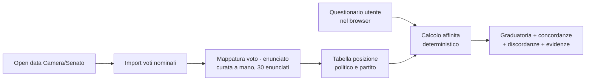
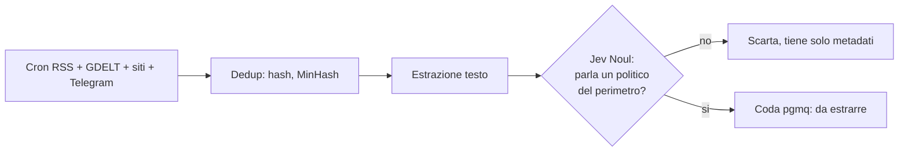
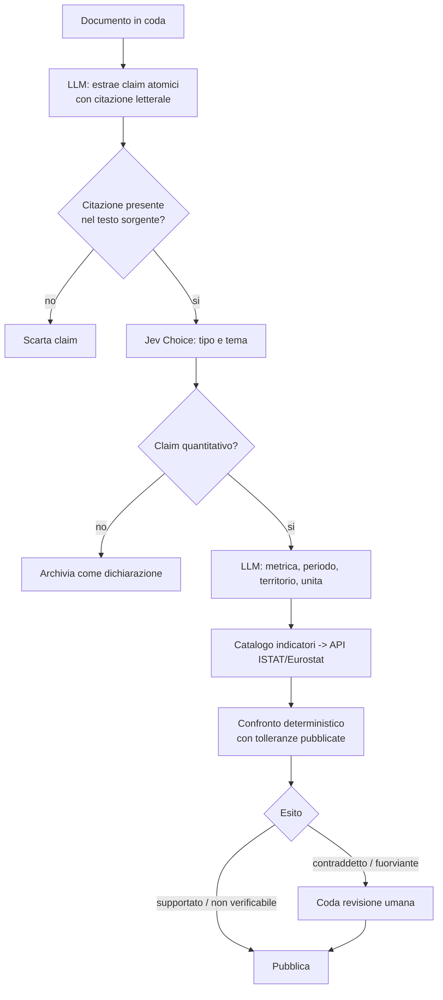
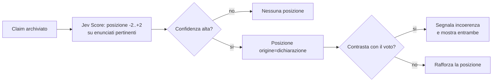
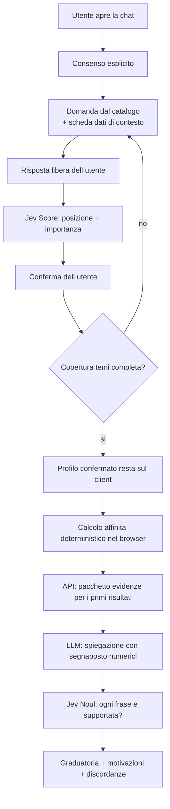
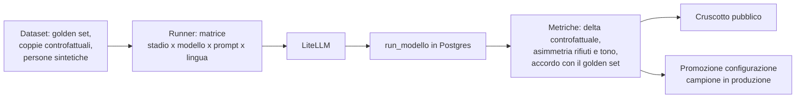

# Architettura MVP e flussi logici

Versione semplice del sistema descritto negli ADR. Obiettivo: arrivare prima possibile a qualcosa che aiuti davvero a decidere un voto, rimandando tutto il resto.

## Principio di taglio

Il valore minimo non richiede LLM. Enunciati curati più voti nominali del Parlamento bastano a calcolare l'affinità e a mostrare le evidenze. Gli LLM servono per scalare (notizie, fact-checking, conversazione), non per il nucleo.

Perimetro iniziale: 8-10 leader, i partiti principali, 30 enunciati, 6 temi, una legislatura di voti, 20 indicatori statistici.

## Componenti

| Componente | Dove | Cosa fa |
|---|---|---|
| App web | Vercel (Next.js) | Sito pubblico, profili, questionario, calcolo affinità nel browser, chat in streaming, backoffice di revisione |
| Gateway modelli | Render (LiteLLM Proxy) | Unico punto di uscita verso OpenAI, Anthropic e Jev; alias versionati, budget, log per stadio |
| Worker | Render (Python) | Cron di ingestion, stadi della pipeline, connettori dati ufficiali, job del laboratorio |
| Database | Supabase (Postgres) | Dati, pgvector, code pgmq, run del laboratorio, Auth per revisori, Storage per documenti temporanei |

Niente altro: nessun motore di workflow, nessun database a grafo, nessun servizio di ricerca separato.

## Modello dati minimo

```
partito(id, nome, coalizione, attivo)
politico(id, nome, partito_id, carica, camera, perimetro)
fonte(id, nome, tipo, livello A|B|C, url)
documento(id, fonte_id, url, data, hash, testo_temporaneo, stato)
claim(id, documento_id, politico_id, testo_citato, data, tipo, tema, stato)
verifica(id, claim_id, indicatore_id, valore_dichiarato, valore_ufficiale,
         esito, nota, revisore_id, pubblicata_il)
indicatore(id, nome, fonte_api, codice_serie, unita, definizione)
serie_valore(indicatore_id, periodo, territorio, valore)
enunciato(id, testo, tema, versione)
voto(id, politico_id, atto, data, esito, enunciato_id, direzione)
posizione(id, soggetto_tipo politico|partito, soggetto_id, enunciato_id,
          valore -2..+2, confidenza, origine voto|dichiarazione, evidenze[])
run_modello(id, stadio, modello, versione, prompt_versione, input_hash,
            output, costo, latenza, esperimento_id)
```

Tutto ciò che è pubblicato è immutabile: le correzioni creano nuove righe con data di registrazione (ADR 0005).

## Flussi logici

### F0 — Nucleo senza LLM (prima cosa da costruire)



Qui non c'è nessun modello. È già un prodotto usabile e difendibile.

### F1 — Ingestion e screening



Lo screening con Jev costa pochissimo e taglia la gran parte del volume prima di qualunque chiamata generativa.

### F2 — Claim e fact-checking



Regola invariante: nessun numero è prodotto da un modello, e nessun esito negativo viene pubblicato senza revisione.

### F3 — Posizioni dalle dichiarazioni

I voti restano la fonte primaria. Le dichiarazioni aggiungono copertura dove il voto non esiste.



### F4 — Chat e raccomandazione



La trascrizione non viene salvata: fa fede solo il profilo confermato.

### F5 — Laboratorio bias



Le probabilità calibrate di Jev rendono il delta controfattuale una misura continua invece di un conteggio di ribaltamenti.

## Ordine di implementazione

**Fase 0 — Nucleo votabile.** Import voti, 30 enunciati, mappatura curata, questionario, affinità, pagine partito. Nessun LLM.

**Fase 1 — Dichiarazioni.** Ingestion RSS e GDELT, screening Jev, estrazione claim, timeline per politico.

**Fase 2 — Fact-checking.** Catalogo di 20 indicatori, connettori ISTAT ed Eurostat, confronto deterministico, backoffice di revisione.

**Fase 3 — Chat.** Intervista guidata, spiegazioni ancorate, validazione delle frasi.

**Fase 4 — Laboratorio.** Dataset, runner, metriche, cruscotto pubblico.

Ogni fase è rilasciabile da sola e le successive non modificano le precedenti: il calcolo dell'affinità resta lo stesso dalla fase 0 in poi.

## Fuori scope nell'MVP

Audio e video, social senza API gratuite, elezioni diverse dalle politiche, collegi e candidati uninominali, stime di costo proprie, grafo delle relazioni, più di due famiglie di modelli generativi.
