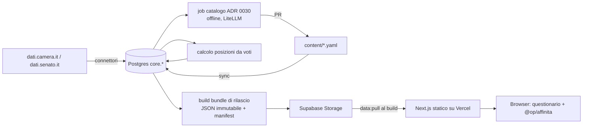
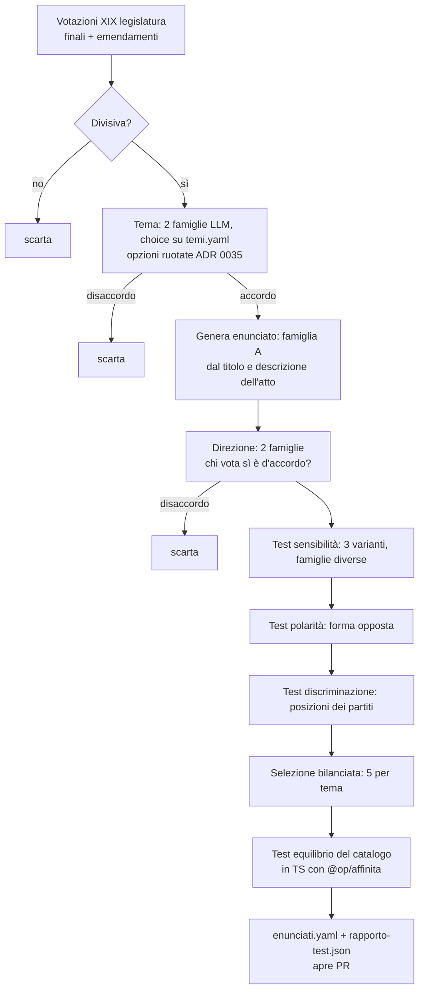

# Piano di implementazione

Piano tecnico derivato dagli ADR 0001–0037 (esclusi 0011 e 0018, sostituiti), da `adr/architettura-mvp.md` e dai mock in `adr/mockup/`, che sono la versione più recente del prodotto. Segue l'ordine delle fasi dell'ADR 0024 e la modalità iniziale senza revisori degli ADR 0030 e 0037.

La fase 0 è descritta al livello del codice: è quella da costruire subito, e le sue fondamenta (schema dati, formato dei contenuti, algoritmo di affinità, bundle di rilascio) non devono cambiare nelle fasi successive. Le fasi 1–5 sono descritte al livello di moduli, tabelle e interfacce, con il codice solo dove un vincolo degli ADR va fissato fin dall'inizio.

Indice

1. [Letture vincolanti e conflitti trovati](#1-letture-vincolanti-e-conflitti-trovati)
2. [Struttura del monorepo](#2-struttura-del-monorepo)
3. [Fase 0 — Nucleo votabile](#3-fase-0--nucleo-votabile)
4. [Fase 1 — Programmi](#4-fase-1--programmi)
5. [Fase 2 — Dichiarazioni](#5-fase-2--dichiarazioni)
6. [Fase 3 — Fact-checking](#6-fase-3--fact-checking)
7. [Fase 4 — Assistente](#7-fase-4--assistente)
8. [Fase 5 — Laboratorio](#8-fase-5--laboratorio)
9. [Requisiti trasversali](#9-requisiti-trasversali)
10. [Sequenza delle pull request](#10-sequenza-delle-pull-request)
11. [Decisioni aperte](#11-decisioni-aperte)

---

## 1. Letture vincolanti e conflitti trovati

### 1.1 Invarianti che il codice deve imporre, non solo rispettare

| Invariante | ADR | Dove viene imposta |
|---|---|---|
| Nessun numero prodotto da un LLM | 0014, 0015 | Il validatore dei segnaposto rifiuta cifre letterali; il comparatore numerico è l'unico produttore di valori |
| Affinità deterministica, senza LLM, uguale dalla fase 0 in poi | 0008, 0024, 0025 | Pacchetto `@op/affinita` puro, con casi di riferimento congelati in CI |
| Il profilo dell'utente non lascia il dispositivo | 0007 | Nessuna API riceve risposte; test Playwright che intercetta tutte le richieste di rete durante il questionario |
| Record pubblicati immutabili, correzioni come nuove righe | 0005, 0023 | Trigger Postgres che vieta `UPDATE`/`DELETE` sulle tabelle append-only |
| Esito negativo solo con citazione verificata, accordo tra due famiglie e confronto fuori tolleranza; "fuorviante per contesto" mai senza revisione | 0037, 0028 | Il job di rilascio scarta gli esiti che non hanno tutte le condizioni registrate; `fuorviante_contesto` esce dal bundle finché `content/governance.yaml` non attiva la revisione |
| Letture comparative: una metrica, soggetti sopra soglia, stessa finestra, pareggi nominati | 0037, 0019 | Generatore deterministico in `rilascio/letture.py` con regole da `content/letture.yaml`; test che verificano ogni condizione |
| Percentuale sempre con conteggio, nascosta sotto soglia | 0019, 0036 | Unico componente `<Quota>` autorizzato a mostrare una percentuale; regola di lint che vieta `%` scritti a mano nei componenti delle viste |
| Ordinamento neutro delle liste | 0009, 0036 | Ordine alfabetico come default nei loader; l'ordinamento per affinità esiste solo nella vista risultato |
| "Non si sa" mai stimato | 0008, 0027, 0030 | `valore: null` è un tipo distinto e gestito esplicitamente dall'algoritmo e dai componenti |
| Contenuto metodologico come dati versionati nel repository | 0022, 0025, 0035 | Cartella `content/` con schema validato in CI |
| Nessuna soglia di confidenza prima della calibrazione | 0033 | Il client Laya restituisce `stato_soglia: "non_calibrata"` finché non esiste un file di calibrazione per quel checkpoint |

### 1.2 Mock e ADR: come sono stati allineati

I mock sono la versione più recente del prodotto. Dove divergevano dagli ADR, gli ADR sono stati aggiornati con l'**ADR 0037**, che modifica 0007, 0008, 0009, 0010, 0013, 0019, 0020, 0028, 0030 e 0036. Il piano segue i mock con le condizioni fissate da quell'ADR:

| Mock | Cosa mostra | Regola dopo l'ADR 0037 | Effetto sul piano |
|---|---|---|---|
| `vista-comefunziona.html`, `vista-partito.html` | "**Numero sbagliato.** Il numero vero è meno della metà", "Ha detto / In realtà" | Esiti dei claim quantitativi pubblicati senza revisione, se la citazione è verificata, le due famiglie concordano sull'interrogazione e il confronto è fuori tolleranza su tutte le definizioni ufficiali. "Fuorviante per contesto" resta in revisione | `<Accostamento>` ha la prop `esito`; il comparatore (§6.2) produce anche la frase di motivazione |
| `vista-soggetti.html` | "In breve": "X è quello che sbaglia più numeri", "X è il più vago", frase qualitativa per soggetto | Letture comparative ammesse, una per metrica, solo tra soggetti sopra soglia e a parità di finestra, con regole e soglie pubblicate | Regole in `content/letture.yaml`, generatore deterministico nel job di rilascio (§3.9) |
| `vista-soggetti.html`, `vista-partito.html` | Conteggi di numeri sbagliati, voti contrari a quanto dichiarato, promesse mantenute | Statistiche dell'ADR 0019 pubblicate da subito, con denominatore e soglia | Le righe appaiono quando la fase che produce i dati è attiva (`manifest.sezioni`); prima, assenza spiegata |
| `vista-partito.html` | Promesse "Mantenuta / A metà / Non mantenuta" con motivazione | Stato da regole fisse su atti e serie ufficiali, collegamento promessa-atto con accordo tra due famiglie | Fase 1 pubblica lo stato (§4) |
| `vista-questionario.html` | 3 risposte, casella "conta più degli altri", margine di pareggio 3, soglia 50%, dettaglio per domanda | Formula del mock adottata; niente intervallo, niente pesi per tema, niente scomposizione per tema | `@op/affinita` implementa esattamente il mock (§3.8) |

I mock sono stati poi corretti dove il loro codice non rispettava le regole:

- `vista-questionario.html`: una posizione 0 del partito è neutra e ha una sua sezione ("Né sì né no"); senza domande confrontabili non si mostra una percentuale; il numero di domande nel testo viene dal catalogo;
- `vista-soggetti.html`: elenchi in ordine alfabetico; "In breve" confronta solo soggetti sopra soglia e nomina tutti quelli a pari merito; il tasso di frasi non controllabili ha il conteggio ("26 frasi su 45"); l'esempio porta la riga di esito; link alla copertura delle fonti per partito (ADR 0006);
- `vista-partito.html`: riga di esito sotto ogni accostamento numerico; l'affermazione non numerica resta un accostamento con la legge, senza esito e fuori dal conteggio; nota sul ruolo accanto alle promesse (ADR 0019);
- `vista-comefunziona.html`: FAQ "Chi decide che un numero è sbagliato?" con le condizioni dell'ADR 0037, e la sospensione di un esito dopo una segnalazione.

Resta una differenza di contenuto, non di regole: le schede "Prima di rispondere" con numeri ("circa 900.000 ragazzi") prendono i numeri dal catalogo indicatori; finché non c'è la fase 3 il contesto usa solo dati del voto d'origine e gli argomenti a favore e contro (§3.7). Il mock usa 8 domande, il catalogo MVP ne ha 30.

### 1.3 Ambiguità degli ADR risolte in questo piano

**LLM nella fase 0.** ADR 0024 dice "nessun LLM" nella fase 0, ADR 0030 genera il catalogo con un modello. Le due cose si conciliano: il modello gira **offline**, in un job che produce un file di dati committato tramite pull request. A runtime la fase 0 non chiama alcun modello.

**Su cosa agiscono i test di sensibilità e polarità (0030).** Le posizioni dei partiti derivano dai voti, quindi non cambiano con la formulazione dell'enunciato. Quello che può cambiare è la **direzione** che lega il voto all'enunciato ("chi ha votato sì è d'accordo con questa frase?"). I test verificano quindi che la direzione resti stabile sulle riformulazioni e si inverta sulla forma opposta, giudicata da modelli di due famiglie diverse. Se la direzione è instabile, l'enunciato è scartato.

**Laya nella fase 0.** Non serve. Prima della calibrazione (0033) Laya non può prendere decisioni con soglia. Le decisioni del job di catalogo (tema, direzione) usano l'accordo tra due famiglie di LLM generativi come cancello: se non sono d'accordo, la votazione è esclusa.

**Coalizioni (0021).** L'affinità di coalizione richiede il programma comune, che arriva con la fase 1. Nella fase 0 il tipo `coalizione` esiste nello schema ma non ha posizioni.

**Test di equilibrio (0022, 0030).** Con la formula `4 - |u - p|` e risposte utente uniformi in {-2, +2}, l'affinità **media** attesa è il 50% per qualunque posizione del partito (0 dà sempre 2/4, ±2 dà 4 o 0 con pari probabilità). La media è quindi bilanciata per costruzione e non serve come test. Lo sbilanciamento emerge nella **frequenza con cui un soggetto risulta primo**, che favorisce i partiti con posizioni estreme e molto documentate. Il test di equilibrio misura perciò la quota di primi posti per area (governo/opposizione) e la confronta con un riferimento (§3.11).

---

## 2. Struttura del monorepo

ADR 0025: monorepo con quattro aree. Strumenti: pnpm workspaces per TypeScript, uv per Python, Supabase CLI per le migrazioni.

```
openpolitica/
├── adr/                          # invariato
├── docs/
│   └── piano-implementazione.md
├── content/                      # contenuto metodologico versionato (ADR 0025)
│   ├── schema/                   # JSON Schema generati da packages/schema (non editare a mano)
│   ├── temi.yaml
│   ├── scala.yaml                # livelli -2..+2 con descrizioni fisse (ADR 0035)
│   ├── parametri.yaml            # soglie di presentazione e di calcolo
│   ├── letture.yaml              # regole delle letture "In breve" e delle frasi qualitative (ADR 0037)
│   ├── governance.yaml           # revisione attiva sì/no, modalità campagna
│   ├── perimetro.yaml            # criterio pubblico + elenco risultante (ADR 0002)
│   ├── partiti.yaml              # anagrafica e successioni (ADR 0027)
│   ├── gruppi.yaml               # gruppo parlamentare -> partito, con date
│   ├── alias/                    # una lista per persona (ADR 0027)
│   ├── catalogo/
│   │   └── v1/
│   │       ├── enunciati.yaml    # generato dal job, rivisto via PR
│   │       └── rapporto-test.json
│   ├── prompt/                   # prompt versionati (dalla fase 0 per il job di catalogo)
│   ├── domande-tipizzate/        # dalla fase 2 (ADR 0035)
│   ├── indicatori.yaml           # dalla fase 3 (ADR 0014)
│   └── fonti.yaml                # paniere delle fonti, dalla fase 2
├── packages/
│   ├── schema/                   # zod: tipi condivisi + generazione JSON Schema
│   ├── affinita/                 # algoritmo di affinità, puro, testato (ADR 0008, 0025)
│   └── ui/                       # token e componenti dai mock (opzionale, può stare in apps/web)
├── apps/
│   ├── web/                      # Next.js pubblico (Vercel)
│   └── backoffice/               # dalla fase 3: revisione e golden set (Supabase Auth)
├── workers/                      # Python (Render)
│   ├── pyproject.toml
│   └── op_workers/
│       ├── comuni/               # db, config, logging, validazione content/
│       ├── anagrafica/
│       ├── connettori/           # camera, senato, poi rss, gdelt, telegram, istat, eurostat
│       ├── posizioni/
│       ├── catalogo/             # job ADR 0030
│       ├── rilascio/             # costruzione e pubblicazione del bundle
│       ├── pipeline/             # dalla fase 2: stadi su pgmq
│       ├── factcheck/            # dalla fase 3
│       └── laboratorio/          # dalla fase 5
├── services/
│   ├── litellm/                  # config.yaml + Dockerfile (Render)
│   └── laya-serve/               # dalla fase 2 (ADR 0032)
├── supabase/
│   ├── migrations/
│   └── seed.sql
├── .github/workflows/
└── package.json, pnpm-workspace.yaml, turbo.json (opzionale)
```

Versioni di riferimento: Node 22 LTS, Next.js 15 (App Router), TypeScript 5 con `strict`, Vitest, Playwright; Python 3.12, uv, pydantic 2, psycopg 3, httpx, pytest, vcrpy; Postgres 15+ su Supabase in regione UE.

---

## 3. Fase 0 — Nucleo votabile

Obiettivo (ADR 0024): import dei voti, catalogo, mappatura voto-enunciato, questionario, affinità nel browser, pagine partito e politico con le evidenze, pagina di metodo. Nessun modello a runtime.

Flusso dei dati:



### 3.1 Fondamenta del repository (PR 1)

- `pnpm-workspace.yaml` con `apps/*` e `packages/*`; `workers/` gestito da uv.
- ESLint, Prettier, `tsc --noEmit`; Ruff e mypy per Python.
- `.github/workflows/ci.yml` con job paralleli: `ts` (lint, typecheck, test), `py` (ruff, mypy, pytest), `content` (validazione schema), `db` (migrazioni su Postgres effimero).
- `LICENSE` (codice) e `content/LICENSE` (contenuti, licenza aperta da scegliere, vedi §11).
- `.env.example` per ogni app/servizio. Segreti solo nelle piattaforme (0025); nessuna chiave di modello in `apps/web`.

### 3.2 Schema del database (PR 2)

Due schemi: `core` per i dati interni (append-only dove pubblicati), `pub` per le viste in sola lettura. Tutte le tabelle hanno `registrato_il` (tempo di registrazione); quelle che descrivono eventi hanno anche il tempo di validità (`data`, `valido_dal`/`valido_al`), come richiesto dal modello bitemporale (0005).

`supabase/migrations/0001_core.sql`:

```sql
create extension if not exists pgcrypto;
create schema if not exists core;
create schema if not exists pub;

-- Blocco delle modifiche: le correzioni sono nuove righe (ADR 0005, 0023)
create or replace function core.append_only() returns trigger
language plpgsql as $$
begin
  raise exception 'La tabella %.% è append-only: inserire una nuova versione', tg_table_schema, tg_table_name;
end $$;

-- ---------- Anagrafica (ADR 0027) ----------
create table core.persona (
  id            uuid primary key default gen_random_uuid(),
  slug          text not null unique,
  nome          text not null,
  cognome       text not null,
  registrato_il timestamptz not null default now()
);

create table core.persona_id_esterno (
  persona_id    uuid not null references core.persona(id),
  fonte         text not null check (fonte in ('camera','senato','openpolis')),
  id_esterno    text not null,
  valido_dal    date not null,
  valido_al     date,
  registrato_il timestamptz not null default now(),
  primary key (fonte, id_esterno, valido_dal)
);

create table core.partito (
  id            uuid primary key default gen_random_uuid(),
  slug          text not null unique,
  nome          text not null,
  attivo        boolean not null default true,
  registrato_il timestamptz not null default now()
);

create table core.partito_successione (
  da_partito    uuid not null references core.partito(id),
  a_partito     uuid not null references core.partito(id),
  tipo          text not null check (tipo in ('rinomina','fusione','scissione')),
  data          date not null,
  primary key (da_partito, a_partito, data)
);

create table core.gruppo_parlamentare (
  id            uuid primary key default gen_random_uuid(),
  ramo          text not null check (ramo in ('camera','senato')),
  legislatura   smallint not null,
  id_esterno    text not null,
  sigla         text not null,
  nome          text not null,
  unique (ramo, legislatura, id_esterno)
);

-- gruppo -> partito con periodo (content/gruppi.yaml). Un gruppo misto non ha partito.
create table core.gruppo_partito (
  gruppo_id     uuid not null references core.gruppo_parlamentare(id),
  partito_id    uuid not null references core.partito(id),
  valido_dal    date not null,
  valido_al     date,
  primary key (gruppo_id, partito_id, valido_dal)
);

-- Appartenenze come relazioni con periodo, non attributi (ADR 0027)
create table core.appartenenza (
  id            uuid primary key default gen_random_uuid(),
  persona_id    uuid not null references core.persona(id),
  tipo          text not null check (tipo in ('partito','gruppo','carica')),
  partito_id    uuid references core.partito(id),
  gruppo_id     uuid references core.gruppo_parlamentare(id),
  carica        text,
  valido_dal    date not null,
  valido_al     date,
  fonte_url     text not null,
  registrato_il timestamptz not null default now(),
  check (
    (tipo = 'partito' and partito_id is not null) or
    (tipo = 'gruppo'  and gruppo_id  is not null) or
    (tipo = 'carica'  and carica     is not null)
  )
);
create index on core.appartenenza (persona_id, tipo, valido_dal);

-- ---------- Voti ----------
create table core.votazione (
  id            uuid primary key default gen_random_uuid(),
  ramo          text not null check (ramo in ('camera','senato')),
  legislatura   smallint not null,
  id_esterno    text not null,
  data          date not null,
  titolo        text not null,
  descrizione   text,
  atto_ref      text,              -- es. 'C.1234' o 'S.567'
  finale        boolean not null,
  fiducia       boolean not null default false,
  favorevoli    int not null,
  contrari      int not null,
  astenuti      int not null,
  approvata     boolean not null,
  url           text not null,
  registrato_il timestamptz not null default now(),
  unique (ramo, legislatura, id_esterno)
);
create index on core.votazione (legislatura, data);

create type core.espressione as enum
  ('favorevole','contrario','astenuto','non_votante','assente','in_missione','presidente');

create table core.voto (
  votazione_id  uuid not null references core.votazione(id),
  persona_id    uuid not null references core.persona(id),
  espressione   core.espressione not null,
  gruppo_id     uuid references core.gruppo_parlamentare(id),  -- gruppo alla data, come riportato dalla fonte
  registrato_il timestamptz not null default now(),
  primary key (votazione_id, persona_id)
);

-- Voti non attribuiti (ADR 0027: mai attribuzione probabilistica)
create table core.voto_non_attribuito (
  votazione_id  uuid not null references core.votazione(id),
  fonte         text not null,
  id_esterno    text not null,
  nominativo    text not null,
  motivo        text not null,
  registrato_il timestamptz not null default now()
);

-- ---------- Catalogo (ADR 0022, 0030) ----------
create table core.tema (
  id            text primary key,     -- 'lavoro', 'fisco', ...
  nome          text not null,
  versione      int not null
);

create table core.enunciato (
  id                 text not null,   -- 'e-lavoro-salario-minimo'
  versione           int  not null,
  catalogo_versione  text not null,   -- 'v1'
  testo              text not null,
  tema_id            text not null references core.tema(id),
  livello_governo    text not null check (livello_governo in ('nazionale','regionale','ue')),
  stato              text not null check (stato in ('attivo','ritirato')),
  origine            jsonb not null,  -- votazione, modello, prompt, hash input
  test               jsonb not null,  -- esiti dei test ADR 0030
  registrato_il      timestamptz not null default now(),
  primary key (id, versione)
);

-- direzione: +1 se "favorevole alla votazione" = "d'accordo con l'enunciato", -1 se inverso
create table core.ancoraggio (
  enunciato_id       text not null,
  enunciato_versione int  not null,
  votazione_id       uuid not null references core.votazione(id),
  direzione          smallint not null check (direzione in (-1, 1)),
  origine            text not null check (origine in ('generazione','manuale')),
  registrato_il      timestamptz not null default now(),
  primary key (enunciato_id, enunciato_versione, votazione_id),
  foreign key (enunciato_id, enunciato_versione) references core.enunciato(id, versione)
);

-- ---------- Posizioni (ADR 0008, 0023) ----------
create table core.posizione (
  id                 uuid primary key default gen_random_uuid(),
  soggetto_tipo      text not null check (soggetto_tipo in ('partito','persona','coalizione')),
  soggetto_id        uuid not null,
  enunciato_id       text not null,
  enunciato_versione int  not null,
  valore             smallint check (valore between -2 and 2),  -- null = non documentata
  stato              text not null check (stato in ('documentata','non_documentata','divergente')),
  confidenza         text check (confidenza in ('piena','ridotta')),
  origine            text not null check (origine in ('voto','dichiarazione')),
  evidenze           jsonb not null default '[]',  -- [{votazione_id, orientamento, peso}]
  calcolo_versione   text not null,                -- versione dell'algoritmo di posizione
  valido_dal         date not null,                -- data dell'evidenza più recente
  registrato_il      timestamptz not null default now(),
  foreign key (enunciato_id, enunciato_versione) references core.enunciato(id, versione)
);
create index on core.posizione (soggetto_tipo, soggetto_id, enunciato_id, registrato_il desc);

-- ---------- Rilasci ----------
create table core.rilascio (
  versione           text primary key,   -- '2026.10.15-1'
  catalogo_versione  text not null,
  calcolo_versione   text not null,
  manifest           jsonb not null,
  storage_path       text not null,
  creato_il          timestamptz not null default now()
);

-- ---------- Correzioni pubbliche (ADR 0012) ----------
create table core.correzione (
  id                 uuid primary key default gen_random_uuid(),
  oggetto_tipo       text not null,
  oggetto_id         text not null,
  prima              jsonb not null,
  dopo               jsonb not null,
  motivazione        text not null,
  segnalazione_id    uuid,
  pubblicata_il      timestamptz not null default now()
);

-- ---------- Segnalazioni (ADR 0012, DSA 0010) ----------
create table core.segnalazione (
  id                 uuid primary key default gen_random_uuid(),
  oggetto_url        text not null,
  testo              text not null check (length(testo) <= 4000),
  contatto           text,              -- facoltativo, cancellato a chiusura
  stato              text not null default 'aperta' check (stato in ('aperta','accolta','respinta')),
  esito              text,
  creata_il          timestamptz not null default now()
);

-- append-only sulle tabelle pubblicate
do $$
declare t text;
begin
  foreach t in array array['votazione','voto','enunciato','ancoraggio','posizione','rilascio','correzione',
                           'appartenenza','persona_id_esterno']
  loop
    execute format('create trigger %I before update or delete on core.%I
                    for each row execute function core.append_only()', 'ao_'||t, t);
  end loop;
end $$;
```

Vista corrente per le posizioni (l'ultima versione registrata per soggetto ed enunciato):

```sql
create view core.posizione_corrente as
select distinct on (soggetto_tipo, soggetto_id, enunciato_id) *
from core.posizione
order by soggetto_tipo, soggetto_id, enunciato_id, enunciato_versione desc, registrato_il desc;
```

Sicurezza (`0002_rls.sql`): RLS attiva su tutte le tabelle `core`; il ruolo `anon` non ha accesso a `core` e ha `insert` solo su `core.segnalazione` tramite una funzione `pub.segnala(...)` con rate limit; i worker usano un ruolo `worker` dedicato, non la service key in tutti i job. Nella fase 0 il sito non legge il database a runtime: legge il bundle (§3.9).

Nota: i trigger append-only impediscono anche le correzioni di import errati. La procedura è inserire una nuova riga e una riga in `core.correzione`; per gli errori di import prima della pubblicazione si usa un database di staging, non la produzione.

### 3.3 Contenuto metodologico e schema condiviso (PR 3)

Gli schemi sono scritti una volta in zod (`packages/schema`) e da lì si generano i JSON Schema in `content/schema/`, che usa anche Python (`jsonschema`). Un solo punto di verità per i tipi.

`packages/schema/src/content.ts`:

```ts
import { z } from "zod";

export const Valore = z.union([z.literal(-2), z.literal(-1), z.literal(0), z.literal(1), z.literal(2)]);
export type Valore = z.infer<typeof Valore>;

export const Tema = z.object({
  id: z.string().regex(/^[a-z-]+$/),
  nome: z.string().min(1),
  descrizione: z.string().max(140),      // ADR 0035: descrizione breve e distintiva
});
export const Temi = z.object({ versione: z.number().int(), temi: z.array(Tema).min(2).max(19) }); // < 20 opzioni (0035)

export const Scala = z.object({
  versione: z.number().int(),
  livelli: z.array(z.object({ valore: Valore, etichetta: z.string(), descrizione: z.string() })).length(5),
});

export const Parametri = z.object({
  versione: z.number().int(),
  presentazione: z.object({
    denominatoreMinimo: z.number().int().positive(),     // ADR 0019, mock: 30
  }),
  affinita: z.object({
    pesoImportante: z.number().int().min(1),            // mock: 2
    margineParita: z.number().int().min(0),             // punti percentuali, mock: 3
    sogliaNessunoTiRappresenta: z.number().int(),       // mock: 50
  }),
  posizioni: z.object({
    quotaMaggioranzaGruppo: z.number(),                 // 0.5: vedi §3.6
    membriMinimi: z.number().int(),
    legislaturaRiferimento: z.number().int(),           // ADR 0023
  }),
});

export const OrigineEnunciato = z.object({
  votazione: z.object({ ramo: z.enum(["camera", "senato"]), legislatura: z.number(), idEsterno: z.string() }),
  direzione: z.union([z.literal(1), z.literal(-1)]),
  generazione: z.object({
    modello: z.string(), prompt: z.string(), promptVersione: z.string(), inputSha256: z.string(),
  }),
});

export const EsitoTest = z.object({ superato: z.boolean(), dettagli: z.record(z.unknown()) });

export const Enunciato = z.object({
  id: z.string().regex(/^e-[a-z0-9-]+$/),
  versione: z.number().int().positive(),
  testo: z.string().min(10).max(160),
  tema: z.string(),
  livelloGoverno: z.enum(["nazionale", "regionale", "ue"]),
  stato: z.enum(["attivo", "ritirato"]),
  origine: OrigineEnunciato,
  ancoraggiAggiuntivi: z.array(z.object({
    ramo: z.enum(["camera", "senato"]), legislatura: z.number(), idEsterno: z.string(),
    direzione: z.union([z.literal(1), z.literal(-1)]),
  })).default([]),
  test: z.object({
    divisivita: EsitoTest, sensibilita: EsitoTest, polarita: EsitoTest, discriminazione: EsitoTest,
  }),
});

export const Catalogo = z.object({
  versione: z.string().regex(/^v\d+$/),
  temi: z.number(),
  enunciatiPerTema: z.number().int(),
  enunciati: z.array(Enunciato),
}).superRefine((c, ctx) => {
  // ADR 0022: numero uguale di enunciati attivi per tema
  const perTema = new Map<string, number>();
  for (const e of c.enunciati.filter((e) => e.stato === "attivo"))
    perTema.set(e.tema, (perTema.get(e.tema) ?? 0) + 1);
  for (const [tema, n] of perTema)
    if (n !== c.enunciatiPerTema)
      ctx.addIssue({ code: "custom", message: `Tema ${tema}: ${n} enunciati, attesi ${c.enunciatiPerTema}` });
});
```

Script `pnpm content:check` (in CI): carica ogni YAML, valida con lo schema, controlla i riferimenti incrociati (temi esistenti, alias di persone presenti in `perimetro.yaml`, gruppi mappati a partiti esistenti, nessun id duplicato) e verifica che `content/schema/*.json` sia allineato a zod (rigenera e fa `git diff --exit-code`).

`content/parametri.yaml` iniziale:

```yaml
versione: 1
presentazione:
  denominatoreMinimo: 30
affinita:
  pesoImportante: 2
  margineParita: 3
  sogliaNessunoTiRappresenta: 50
posizioni:
  quotaMaggioranzaGruppo: 0.5
  membriMinimi: 3
  legislaturaRiferimento: 19
```

`content/scala.yaml` (stessi livelli ovunque, ADR 0035):

```yaml
versione: 1
livelli:
  - { valore: 2,  etichetta: "Molto d'accordo",   descrizione: "Sostiene la misura senza riserve" }
  - { valore: 1,  etichetta: "D'accordo",         descrizione: "Sostiene la misura con riserve o in parte" }
  - { valore: 0,  etichetta: "Né sì né no",       descrizione: "Posizione divisa, astensione o non schierata" }
  - { valore: -1, etichetta: "Contrario",         descrizione: "Si oppone alla misura con riserve o in parte" }
  - { valore: -2, etichetta: "Molto contrario",   descrizione: "Si oppone alla misura senza riserve" }
```

`content/perimetro.yaml` (criterio pubblico prima dell'elenco, ADR 0002):

```yaml
versione: 1
criterio: >
  Partiti con almeno un gruppo parlamentare autonomo in una delle due Camere nella
  legislatura di riferimento; per ciascuno, il segretario o presidente in carica.
  Membri del governo con portafoglio.
legislatura: 19
partiti: [ ... slug ... ]
persone:
  - slug: ...
    motivo: "segretaria di partito"   # quale regola la include
```

### 3.4 Anagrafica e risoluzione delle identità (PR 4)

Modulo `workers/op_workers/anagrafica/`:

- `sync_content.py`: carica `partiti.yaml`, `gruppi.yaml`, `perimetro.yaml`, `alias/*.yaml` e inserisce in `core` solo le differenze (le tabelle sono append-only: un cambio di periodo è una nuova riga).
- `riconcilia.py`: costruisce la tabella `persona_id_esterno` dagli identificativi Camera e Senato. La regola è conservativa: un identificativo esterno viene collegato a una persona interna solo se l'abbinamento è dichiarato in `content/alias/<slug>.yaml` (campo `ids_esterni`). Gli identificativi esterni senza abbinamento dei parlamentari fuori perimetro generano persone interne automatiche (servono per calcolare le posizioni dei partiti), mai fuse con persone esistenti.
- `controlli.py` (ADR 0027 "Controlli"): persone con due identità nello stesso ramo e periodo; voti attribuiti a una persona fuori dal suo periodo di mandato; numero di deputati attivi per data diverso da 400 e di senatori elettivi diverso da 200 (più i senatori a vita). Ogni violazione fallisce il job.

Esempio `content/alias/<slug>.yaml`:

```yaml
slug: <slug>
nome: <Nome>
cognome: <Cognome>
forme: ["<Nome Cognome>", "<Cognome>"]
ids_esterni:
  - { fonte: camera, id: "<id>", valido_dal: 2022-10-13 }
```

Attribuzione del voto al partito alla data (ADR 0023, 0027):

```sql
create function core.partito_alla_data(p_persona uuid, p_gruppo uuid, p_data date)
returns uuid language sql stable as $$
  -- 1) il gruppo della votazione mappato a un partito alla data
  select gp.partito_id from core.gruppo_partito gp
  where gp.gruppo_id = p_gruppo and p_data >= gp.valido_dal and (gp.valido_al is null or p_data <= gp.valido_al)
  union all
  -- 2) altrimenti l'appartenenza di partito della persona alla data (es. gruppo misto)
  select a.partito_id from core.appartenenza a
  where a.persona_id = p_persona and a.tipo = 'partito'
    and p_data >= a.valido_dal and (a.valido_al is null or p_data <= a.valido_al)
  limit 1
$$;
```

### 3.5 Connettori Camera e Senato (PR 5)

Interfaccia comune dei connettori (ADR 0002: scoperta, download, estrazione, normalizzazione). In fase 0 i connettori producono record strutturati, non documenti testuali.

`workers/op_workers/connettori/base.py`:

```python
from __future__ import annotations
from abc import ABC, abstractmethod
from collections.abc import Iterator
from dataclasses import dataclass
from datetime import date


@dataclass(frozen=True)
class VotazioneGrezza:
    ramo: str                  # 'camera' | 'senato'
    legislatura: int
    id_esterno: str
    data: date
    titolo: str
    descrizione: str | None
    atto_ref: str | None
    finale: bool
    fiducia: bool
    favorevoli: int
    contrari: int
    astenuti: int
    approvata: bool
    url: str


@dataclass(frozen=True)
class VotoGrezzo:
    id_votazione_esterno: str
    id_persona_esterno: str
    nominativo: str
    espressione: str           # normalizzata su core.espressione
    id_gruppo_esterno: str | None


class ConnettoreVoti(ABC):
    ramo: str

    @abstractmethod
    def votazioni(self, legislatura: int, dal: date | None = None) -> Iterator[VotazioneGrezza]: ...

    @abstractmethod
    def voti(self, legislatura: int, id_votazione_esterno: str) -> Iterator[VotoGrezzo]: ...
```

`workers/op_workers/connettori/camera.py` (SPARQL su `https://dati.camera.it/sparql`). Le classi e i predicati dell'ontologia OCD qui sotto (`ocd:votazione`, `ocd:voto`, `ocd:rif_votazione`, `ocd:rif_deputato`, `ocd:votazioneFinale`, `ocd:favorevoli`, …) vanno **verificati sull'endpoint** come primo passo del PR: da questo ambiente l'endpoint non era raggiungibile. Il test di contratto con risposta registrata (§9.3) congela la forma verificata.

```python
import httpx
from tenacity import retry, stop_after_attempt, wait_exponential

ENDPOINT = "https://dati.camera.it/sparql"

Q_VOTAZIONI = """
PREFIX ocd: <http://dati.camera.it/ocd/>
PREFIX dc:  <http://purl.org/dc/elements/1.1/>
SELECT ?v ?data ?titolo ?descr ?finale ?fav ?con ?ast ?approvato WHERE {
  ?v a ocd:votazione ;
     ocd:rif_leg <http://dati.camera.it/ocd/legislatura.rdf/repubblica_%(leg)d> ;
     dc:date ?data ; dc:title ?titolo ;
     ocd:votazioneFinale ?finale ;
     ocd:favorevoli ?fav ; ocd:contrari ?con ; ocd:astenuti ?ast ;
     ocd:approvato ?approvato .
  OPTIONAL { ?v dc:description ?descr }
  FILTER (?data >= "%(dal)s")
} ORDER BY ?data ?v LIMIT %(limit)d OFFSET %(offset)d
"""

ESPRESSIONI = {
    "Favorevole": "favorevole", "Contrario": "contrario", "Astensione": "astenuto",
    "Non ha votato": "non_votante", "In missione": "in_missione", "Presidente di turno": "presidente",
}


class ConnettoreCamera(ConnettoreVoti):
    ramo = "camera"

    def __init__(self, client: httpx.Client | None = None, pagina: int = 2000) -> None:
        self.http = client or httpx.Client(timeout=60, headers={"User-Agent": "openpolitica/0.1 (+contatto)"})
        self.pagina = pagina

    @retry(stop=stop_after_attempt(4), wait=wait_exponential(multiplier=2))
    def _query(self, q: str) -> list[dict]:
        r = self.http.get(ENDPOINT, params={"query": q},
                          headers={"Accept": "application/sparql-results+json"})
        r.raise_for_status()
        return r.json()["results"]["bindings"]

    def votazioni(self, legislatura, dal=None):
        offset = 0
        while True:
            righe = self._query(Q_VOTAZIONI % {"leg": legislatura, "dal": (dal or date(1990, 1, 1)).isoformat(),
                                               "limit": self.pagina, "offset": offset})
            for b in righe:
                yield self._normalizza_votazione(b, legislatura)
            if len(righe) < self.pagina:
                return
            offset += self.pagina
    # voti(): query analoga su ocd:voto filtrata per ocd:rif_votazione, mappa ESPRESSIONI;
    # un valore non presente in ESPRESSIONI solleva errore (meglio fermarsi che importare male).
```

`senato.py`: stessa interfaccia su `https://dati.senato.it/sparql` (ontologia OSR) o sui dump della legislatura; anche qui i nomi delle proprietà si fissano con il test di contratto.

Job `op voti importa --legislatura 19 [--dal YYYY-MM-DD]` (`connettori/importa_voti.py`):

1. Legge l'ultima `data` importata per ramo e chiede le votazioni da quella data (idempotente: `on conflict (ramo, legislatura, id_esterno) do nothing`).
2. Per ogni votazione nuova importa i voti nominali; risolve `id_persona_esterno` tramite `persona_id_esterno` valido alla data; se la risoluzione fallisce scrive in `core.voto_non_attribuito`.
3. Controllo di coerenza: la somma dei voti `favorevole` importati deve coincidere con `favorevoli` della votazione (tolleranza 0). In caso contrario la votazione è marcata e non usata per le posizioni.
4. Esecuzione: cron giornaliero su Render (ADR 0002), più il backfill iniziale come job separato.

### 3.6 Calcolo delle posizioni dai voti (PR 6)

Regole (ADR 0008, 0023, 0027), versionate come `calcolo_versione = "pos-voti-1"`:

1. **Orientamento di una persona su una votazione:** `favorevole → +1`, `contrario → -1`, `astenuto → 0`; ogni altra espressione non è evidenza.
2. **Orientamento di un partito su una votazione:** tra i suoi membri alla data che hanno espresso `favorevole`, `contrario` o `astenuto`, `q = (fav - con) / (fav + con + ast)`. Se i membri votanti sono meno di `membriMinimi`, nessuna evidenza. Se `q ≥ quotaMaggioranzaGruppo` → `+1`, se `q ≤ -quotaMaggioranzaGruppo` → `-1`, altrimenti `0` (diviso o astenuto). Regola a soglie, non continua (0023).
3. **Orientamento rispetto all'enunciato:** `orientamento × direzione` dell'ancoraggio.
4. **Posizione sull'enunciato:** solo votazioni della legislatura di riferimento. `valore = arrotonda(2 × media degli orientamenti)` con arrotondamento lontano da zero sui mezzi, quindi in {-2..+2}. Confidenza `piena`.
5. **Divergenza:** se tra le votazioni ancorate compaiono sia `+1` sia `-1`, `stato = 'divergente'`: il valore resta la media, ma le evidenze contrarie vengono mostrate entrambe con le date e la scheda segnala il cambio (0008, 0023). Non si appiana.
6. **Fallback storico:** se nella legislatura di riferimento non c'è evidenza, si usa la votazione più recente disponibile in legislature precedenti, `confidenza = 'ridotta'`, `valido_dal` = data di quella votazione (0023).
7. **Nessuna evidenza:** riga con `valore = null`, `stato = 'non_documentata'`. Il dato mancante è esplicito, non è assenza di riga.

`workers/op_workers/posizioni/da_voti.py`:

```python
from dataclasses import dataclass
from decimal import Decimal, ROUND_HALF_UP
from typing import Literal

Orient = Literal[-1, 0, 1]
CALCOLO_VERSIONE = "pos-voti-1"


@dataclass(frozen=True)
class Parametri:
    quota_maggioranza: Decimal   # 0.5
    membri_minimi: int           # 3


def orientamento_persona(espressione: str) -> Orient | None:
    return {"favorevole": 1, "contrario": -1, "astenuto": 0}.get(espressione)


def orientamento_gruppo(espressioni: list[str], p: Parametri) -> Orient | None:
    fav = espressioni.count("favorevole")
    con = espressioni.count("contrario")
    ast = espressioni.count("astenuto")
    votanti = fav + con + ast
    if votanti < p.membri_minimi:
        return None
    q = Decimal(fav - con) / Decimal(votanti)
    if q >= p.quota_maggioranza:
        return 1
    if q <= -p.quota_maggioranza:
        return -1
    return 0


def _arrotonda(x: Decimal) -> int:
    # lontano da zero sui mezzi: 0.5 -> 1, -0.5 -> -1 (simmetrico per costruzione)
    segno = 1 if x >= 0 else -1
    return segno * int(abs(x).quantize(Decimal("1"), rounding=ROUND_HALF_UP))


@dataclass(frozen=True)
class Evidenza:
    votazione_id: str
    data: str
    orientamento: Orient       # già moltiplicato per la direzione dell'ancoraggio


@dataclass(frozen=True)
class Posizione:
    valore: int | None
    stato: Literal["documentata", "non_documentata", "divergente"]
    confidenza: Literal["piena", "ridotta"] | None
    evidenze: list[Evidenza]


def posizione(correnti: list[Evidenza], precedenti: list[Evidenza]) -> Posizione:
    if correnti:
        media = Decimal(sum(e.orientamento for e in correnti)) / Decimal(len(correnti))
        valore = max(-2, min(2, _arrotonda(2 * media)))
        orient = {e.orientamento for e in correnti}
        stato = "divergente" if {1, -1} <= orient else "documentata"
        return Posizione(valore, stato, "piena", correnti)
    if precedenti:
        ultima = max(precedenti, key=lambda e: e.data)
        return Posizione(2 * ultima.orientamento, "documentata", "ridotta", [ultima])
    return Posizione(None, "non_documentata", None, [])
```

Il job `op posizioni calcola --catalogo v1` calcola le posizioni per ogni partito del perimetro e ogni persona del perimetro, confronta con `core.posizione_corrente` e inserisce una nuova riga solo se cambia `valore`, `stato`, `confidenza` o l'insieme delle evidenze. Test unitari con tabelle di casi (`pytest.mark.parametrize`) su: soglie esatte (q = 0,5 e q = -0,5), simmetria (invertire tutte le espressioni inverte il valore), divergenza, fallback, gruppo misto.

### 3.7 Generazione automatica del catalogo (PR 7–8)

ADR 0030, eseguito offline dal job `op catalogo genera --versione v1`. È l'unico punto della fase 0 che usa modelli, tramite il gateway LiteLLM (§9.1) con alias pinnati, e ogni chiamata è registrata in `core.run_modello` (tabella creata già ora, schema in §8).

Passi:



**Divisività** (`catalogo/selezione.py`):

```python
def divisiva(v: Votazione, orient_partiti: dict[str, int | None]) -> bool:
    # minoranza consistente su entrambi i fronti, misurata sui voti espressi...
    espressi = v.favorevoli + v.contrari
    if espressi == 0 or v.fiducia:      # i voti di fiducia misurano la maggioranza, non la misura
        return False
    minoranza = min(v.favorevoli, v.contrari) / espressi
    # ...e almeno un partito del perimetro per ciascun lato
    lati = {o for o in orient_partiti.values() if o in (1, -1)}
    return minoranza >= 0.25 and lati == {1, -1}
```

La soglia 0,25 diventa un parametro in `parametri.yaml` (`catalogo.minoranzaMinima`) e si riporta nel rapporto.

**Accordo tra famiglie.** Le decisioni di tema e direzione sono chiamate a output strutturato (JSON schema) su due alias di famiglie diverse, temperatura 0, 3 ripetizioni ciascuno. Si accetta solo se tutte e 6 le risposte coincidono. Le opzioni di tema sono presentate in rotazione (ADR 0035): ogni ripetizione usa un ordine diverso.

`catalogo/decisioni.py`:

```python
from op_workers.comuni.llm import chiama_strutturato   # wrapper LiteLLM che registra run_modello

FAMIGLIE = ("catalogo-a", "catalogo-b")   # alias LiteLLM pinnati in services/litellm/config.yaml

def decidi_direzione(enunciato: str, votazione: Votazione) -> int | None:
    risposte = []
    for alias in FAMIGLIE:
        for rip in range(3):
            out = chiama_strutturato(
                alias=alias, prompt_id="direzione", prompt_versione="1",
                variabili={"titolo_atto": votazione.titolo, "descrizione": votazione.descrizione or "",
                           "enunciato": enunciato},
                schema={"type": "object", "properties": {"chi_vota_si_e": {"enum": ["d_accordo", "contrario"]}},
                        "required": ["chi_vota_si_e"]},
                ripetizione=rip, stadio="catalogo.direzione",
            )
            risposte.append(1 if out["chi_vota_si_e"] == "d_accordo" else -1)
    return risposte[0] if len(set(risposte)) == 1 else None
```

I prompt stanno in `content/prompt/catalogo/{tema,genera,direzione,variante,opposto}.v1.md`, con il testo dell'atto dentro delimitatori espliciti e l'istruzione di trattarlo come contenuto (ADR 0026). Regole di generazione nel prompt `genera` riprese dall'ADR 0022: una sola misura concreta, nessuna congiunzione che unisca due questioni, linguaggio non connotato, massimo 160 caratteri, plausibile essere a favore e contro.

**Test di sensibilità.** Tre varianti dell'enunciato, generate da famiglie diverse da quella che ha scritto l'originale. Per ciascuna si rifà `decidi_direzione`. Superato se tutte e tre restituiscono la stessa direzione dell'originale.

**Test di polarità.** Si genera la forma opposta e si chiede la direzione: deve risultare invertita. Superato se `direzione(opposto) == -direzione(originale)`.

**Test di discriminazione.** Si calcolano le posizioni dei partiti sull'enunciato (§3.6) con il solo ancoraggio d'origine. Superato se esiste almeno un partito con valore ≥ 1 e almeno uno con valore ≤ -1.

**Scheda "Prima di rispondere".** Per ogni enunciato il job produce anche il contesto mostrato prima della domanda (ADR 0013, mock del questionario): una frase fattuale a template dal voto d'origine ("In Parlamento se ne è votato nel 2023: la proposta è stata respinta") e, da modelli di due famiglie, una frase per chi è a favore e una per chi è contro, con la stessa lunghezza massima e la stessa struttura. Nessun numero nel testo generato: i numeri entrano solo come segnaposto risolti dal catalogo indicatori, dalla fase 3. Il contesto è nel file del catalogo e passa dalla stessa PR.

**Selezione bilanciata.** Tra i candidati che passano tutti i test, per ogni tema si scelgono 5 enunciati: si preferiscono votazioni finali sugli emendamenti, poi le più recenti, poi le più divisive; mai due enunciati dallo stesso atto. Se un tema ha meno di 5 candidati, il job fallisce con un rapporto: il numero per tema resta uguale per tutti (0022), si riduce per tutti i temi oppure si cambia tassonomia, non si riempie a mano.

**Rapporto.** `content/catalogo/v1/rapporto-test.json` contiene tutte le votazioni considerate, il motivo di ogni scarto e l'esito di ogni test, con gli id dei run. Diventa pubblico (pagina `/metodo/catalogo`).

### 3.8 Pacchetto di affinità `@op/affinita` (PR 9)

È il cuore del prodotto e non cambia dalla fase 0 in poi (0024). Puro, senza dipendenze, deterministico, usato dal browser, dagli script di equilibrio e dai test. Implementa la formula del mock `vista-questionario.html` come fissata dall'ADR 0037.

Regole:

- Risposte dell'utente: +2 "Sono d'accordo", −2 "Sono contrario", 0 "Non ho un'opinione". Le domande con 0 o saltate non entrano nel calcolo.
- Peso: `w = importante ? pesoImportante : 1` (casella "Questo argomento per me conta più degli altri", `pesoImportante = 2`).
- Se la posizione del soggetto è `null`: la domanda è **mancante**, non entra nel calcolo e si conta per dire "su N domande non abbiamo trovato nessun voto".
- Altrimenti: `punti += (4 - |u - p|) × w`, `massimo += 4 × w`.
- Categoria della singola domanda: `concorde` se segni uguali e `p ≠ 0`; `discorde` se segni opposti; `neutrale` se `p = 0`.
- `affinita = round(100 × punti / massimo)`; `null` se `massimo = 0`.
- Pareggio: sono "alla pari" con il primo i soggetti con `affinita ≥ primo.affinita - margineParita` (`margineParita = 3`).
- "Nessuno ti rappresenta": `primo.affinita < sogliaNessunoTiRappresenta` (50).
- Ordinamento: affinità decrescente, a parità per `id` crescente. Si usa l'id e non `localeCompare`, che dipende dall'ambiente. I soggetti con `affinita = null` vanno in fondo.
- Tutta l'aritmetica è su interi fino alla divisione finale: stessi input, stesso output su ogni browser.

L'algoritmo accetta già i valori ±1 per l'utente: aggiungere pulsanti intermedi in futuro non cambierebbe il calcolo.

`packages/affinita/src/index.ts`:

```ts
export type Valore = -2 | -1 | 0 | 1 | 2;

export interface Enunciato { id: string; tema: string }
export interface Risposta { valore: Valore | null; importante: boolean }   // null = saltata
export interface PosizioneSoggetto {
  valore: Valore | null;
  stato: "documentata" | "non_documentata" | "divergente";
  confidenza: "piena" | "ridotta" | null;
}
export interface Soggetto {
  id: string;
  nome: string;
  tipo: "partito" | "persona" | "coalizione";
  posizioni: Record<string, PosizioneSoggetto>;
}
export interface Parametri {
  pesoImportante: number;
  margineParita: number;
  sogliaNessunoTiRappresenta: number;
}
export type Categoria = "concorde" | "discorde" | "neutrale" | "mancante";

export interface DettaglioDomanda {
  enunciatoId: string; categoria: Categoria; utente: Valore; soggetto: Valore | null; peso: number;
}

export interface RisultatoSoggetto {
  id: string;
  nome: string;
  affinita: number | null;
  risposte: number;              // domande con un'opinione
  concordi: string[];
  discordi: string[];
  neutrali: string[];
  mancanti: string[];
  dettaglio: DettaglioDomanda[]; // per domanda, nell'ordine del catalogo
}

export interface Risultato {
  soggetti: RisultatoSoggetto[]; // ordinati per affinità
  primi: string[];               // ids alla pari in testa
  nessunoTiRappresenta: boolean;
  calcoloVersione: "aff-1";
}

const segno = (v: number) => (v > 0 ? 1 : v < 0 ? -1 : 0);

export function calcola(
  catalogo: readonly Enunciato[],
  risposte: Readonly<Record<string, Risposta>>,
  soggetti: readonly Soggetto[],
  par: Parametri,
): Risultato {
  const risultati = soggetti.map((s) => valuta(catalogo, risposte, s, par));
  risultati.sort((a, b) =>
    (b.affinita ?? -1) - (a.affinita ?? -1) || (a.id < b.id ? -1 : a.id > b.id ? 1 : 0));

  const primo = risultati.find((r) => r.affinita !== null);
  const primi = primo
    ? risultati.filter((r) => r.affinita !== null && r.affinita >= primo.affinita! - par.margineParita)
               .map((r) => r.id)
    : [];
  return {
    soggetti: risultati,
    primi,
    nessunoTiRappresenta: !!primo && primo.affinita! < par.sogliaNessunoTiRappresenta,
    calcoloVersione: "aff-1",
  };
}

function valuta(
  catalogo: readonly Enunciato[], risposte: Readonly<Record<string, Risposta>>, s: Soggetto, par: Parametri,
): RisultatoSoggetto {
  let punti = 0, massimo = 0, conRisposta = 0;
  const concordi: string[] = [], discordi: string[] = [], neutrali: string[] = [], mancanti: string[] = [];
  const dettaglio: DettaglioDomanda[] = [];

  for (const e of catalogo) {
    const r = risposte[e.id];
    if (!r || r.valore === null || r.valore === 0) continue;      // saltata o "non ho un'opinione"
    const w = r.importante ? par.pesoImportante : 1;
    conRisposta++;
    const p = s.posizioni[e.id]?.valore ?? null;
    if (p === null) {
      mancanti.push(e.id);
      dettaglio.push({ enunciatoId: e.id, categoria: "mancante", utente: r.valore, soggetto: null, peso: w });
      continue;
    }
    punti += (4 - Math.abs(r.valore - p)) * w;
    massimo += 4 * w;
    const cat: Categoria = p === 0 ? "neutrale" : segno(p) === segno(r.valore) ? "concorde" : "discorde";
    (cat === "concorde" ? concordi : cat === "discorde" ? discordi : neutrali).push(e.id);
    dettaglio.push({ enunciatoId: e.id, categoria: cat, utente: r.valore, soggetto: p, peso: w });
  }

  return {
    id: s.id, nome: s.nome,
    affinita: massimo > 0 ? Math.round((100 * punti) / massimo) : null,
    risposte: conRisposta,
    concordi, discordi, neutrali, mancanti, dettaglio,
  };
}
```

Test (`packages/affinita/test/`):

- **Casi di riferimento congelati** (`casi/*.json`: input e output atteso). Il CI fallisce se un output cambia. Cambiare un caso richiede di cambiare `calcoloVersione` e una voce di changelog metodologico (0012).
- **Proprietà** con `fast-check`:
  - simmetria: invertendo i segni di tutte le risposte e di tutte le posizioni il risultato non cambia;
  - permutazione: l'ordine dei soggetti in input e l'ordine del catalogo non cambiano l'output;
  - monotonia: avvicinare una posizione alla risposta non riduce l'affinità;
  - limiti: `0 ≤ affinita ≤ 100`; `concordi + discordi + neutrali + mancanti = risposte`;
  - un soggetto senza posizioni ha sempre `affinita = null`;
  - indipendenza: aggiungere un soggetto non cambia l'affinità degli altri.
- **Regressione sul mock**: un test riproduce i dati di `vista-questionario.html` (8 domande, 8 partiti) e verifica che percentuali, pareggi e "nessuno ti rappresenta" coincidano con il mock, tranne le due differenze volute dell'ADR 0037 (posizione 0 neutrale, `null` al posto di 0%).

### 3.9 Bundle di rilascio (PR 10)

Il sito non interroga il database. Un job costruisce un **bundle immutabile e versionato** di file JSON; il build di Next.js scarica la versione fissata e genera pagine statiche. Vantaggi: riproducibilità (0005), sito in piedi anche se database, worker o modelli sono giù (0021, 0029), traffico di lettura a costo nullo, dataset pubblico scaricabile (0025).

Formato `release/<versione>/`:

```
manifest.json
catalogo.json        # temi, scala, enunciati attivi con id, testo, tema, contesto
soggetti.json        # partiti e persone del perimetro, ruolo alla data, slug
posizioni.json       # { [soggettoId]: { [enunciatoId]: PosizioneSoggetto + evidenze[] } }
votazioni.json       # solo le votazioni referenziate: id, ramo, data, titolo, atto, url, esito
voti-soggetti.json   # per ogni soggetto e votazione referenziata: espressione o orientamento
parametri.json       # copia di content/parametri.yaml
```

`manifest.json`:

```json
{
  "versione": "2026.10.15-1",
  "creato_il": "2026-10-15T04:12:00Z",
  "catalogo_versione": "v1",
  "calcolo_posizioni": "pos-voti-1",
  "calcolo_affinita": "aff-1",
  "fonti": {
    "camera": { "legislatura": 19, "ultima_votazione": "2026-10-14" },
    "senato": { "legislatura": 19, "ultima_votazione": "2026-10-14" }
  },
  "copertura": {
    "voti": { "dal": "2022-10-13", "al": "2026-10-14" },
    "dichiarazioni": null,
    "programmi": null
  },
  "sezioni": {
    "posizioni": true,
    "promesse": false,
    "numeri": false,
    "coerenza_parole_voti": false,
    "letture": false,
    "fuorviante_contesto": false
  },
  "file": { "catalogo.json": "sha256:…", "soggetti.json": "sha256:…" }
}
```

`manifest.sezioni` decide cosa mostra il sito. `promesse`, `numeri` e `coerenza_parole_voti` si accendono quando la fase che produce quei dati è attiva e ha almeno un soggetto sopra soglia; `letture` quando esiste almeno una metrica con due soggetti sopra soglia. `fuorviante_contesto` è l'unico flag letto da `content/governance.yaml`: si accende solo quando esiste capacità di revisione (ADR 0028, 0037), con una PR che è anche una decisione documentata.

**Letture e frasi qualitative (ADR 0037).** Il job di rilascio genera anche `letture.json` da `content/letture.yaml`:

```yaml
versione: 1
denominatoreMinimo: 30
frasi_numeri:                     # frase per soggetto nell'indice
  - { se: "denominatore < 30", testo: "Ha detto pochi numeri controllabili, quindi su questo non possiamo dire molto." }
  - { se: "quota >= 0.15",     testo: "Sbaglia spesso i numeri: {n} volte su {d}." }
  - { se: "quota <= 0.06",     testo: "Quando dice un numero, di solito è giusto: sbagliato {n} volte su {d}." }
  - { altrimenti: true,        testo: "Sui numeri va così così: sbagliati {n} su {d}." }
letture:                          # "In breve", una per metrica
  - { metrica: numeri_sbagliati,     verso: max, testo: "{soggetti} è quello che sbaglia più numeri.", sotto: "{n} numeri sbagliati su {d} che abbiamo potuto controllare." }
  - { metrica: non_controllabili,    verso: max, testo: "{soggetti} è il più vago: parla senza dire niente di controllabile.", sotto: "{n} frasi su {d}." }
  - { metrica: voti_contrari,        verso: max, testo: "{soggetti} dice una cosa e poi in aula vota il contrario.", sotto: "È successo {n} volte su {d}." }
  - { metrica: promesse_non_mantenute, aggregata: true, testo: "Promesse rimaste solo sulla carta.", sotto: "Su {d} promesse scritte nei programmi." }
```

```python
# workers/op_workers/rilascio/letture.py
def lettura(regola: Regola, metriche: dict[str, Conteggio], minimo: int) -> Lettura | None:
    ammessi = {s: c for s, c in metriche.items() if c.denominatore >= minimo}
    if len(ammessi) < 2:                      # un confronto richiede almeno due soggetti sopra soglia
        return None
    quote = {s: Fraction(c.numeratore, c.denominatore) for s, c in ammessi.items()}
    estremo = max(quote.values()) if regola.verso == "max" else min(quote.values())
    vincitori = sorted(s for s, q in quote.items() if q == estremo)   # pareggi: tutti nominati
    return Lettura(regola.id, vincitori, [ammessi[s] for s in vincitori])
```

Le metriche usano tutte la stessa finestra temporale e lo stesso paniere di fonti (ADR 0019, 0023); `Fraction` evita confronti instabili tra quote quasi uguali. Il rapporto di copertura per schieramento dell'ADR 0006 viene esportato insieme e linkato dalla sezione "In breve".

Il job `op rilascio crea` valida ogni file con gli schemi di `packages/schema` (esportati in JSON Schema), carica su Supabase Storage nel bucket pubblico `rilasci/` e registra `core.rilascio`. `op rilascio pubblica <versione>` aggiorna il puntatore `rilasci/corrente.json` e chiama il deploy hook di Vercel. Il passaggio a una nuova versione è quindi un evento esplicito e registrato.

### 3.10 Applicazione web (PR 11–15)

**Dati al build.** `apps/web/scripts/pull-data.ts` scarica `rilasci/<RELEASE_VERSION|corrente>` in `apps/web/.data/`, verifica gli hash del manifest e fallisce il build se non tornano. Loader tipizzati in `apps/web/lib/dati.ts` validano con zod e ordinano le liste alfabeticamente (0009):

```ts
import { readFileSync } from "node:fs";
import path from "node:path";
import { Manifest, CatalogoPubblico, SoggettiPubblici, PosizioniPubbliche } from "@op/schema/rilascio";

const DIR = path.join(process.cwd(), ".data");
const leggi = <T>(f: string, schema: { parse: (x: unknown) => T }) =>
  schema.parse(JSON.parse(readFileSync(path.join(DIR, f), "utf8")));

export const manifest = () => leggi("manifest.json", Manifest);
export const catalogo = () => leggi("catalogo.json", CatalogoPubblico);
export const soggetti = (tipo: "partito" | "persona") =>
  leggi("soggetti.json", SoggettiPubblici)
    .filter((s) => s.tipo === tipo)
    .sort((a, b) => a.nome.localeCompare(b.nome, "it"));   // ordine neutro predefinito (ADR 0009, 0036)
export const posizioni = () => leggi("posizioni.json", PosizioniPubbliche);
```

**Rotte** (App Router, tutte statiche tranne la segnalazione):

| Rotta | Vista | Note |
|---|---|---|
| `/` | Indice dei soggetti (`vista-soggetti.html`) | Schede Partiti/Persone, ordine alfabetico |
| `/partiti/[slug]`, `/persone/[slug]` | Scheda soggetto (`vista-partito.html`) | `generateStaticParams` dal bundle |
| `/domande` | Questionario e risultato (`vista-questionario.html`) | Client component; scarica `/dati/questionario.json` statico |
| `/come-funziona` | Come funziona (`vista-comefunziona.html`) | Esempio con esito "Numero sbagliato" e motivazione, come nel mock |
| `/metodo/catalogo` | Elenco degli enunciati con votazione d'origine, direzione e test | Richiesto da 0022 e 0030 (mappatura pubblica) |
| `/metodo/dati` | Download del bundle corrente e delle versioni precedenti | 0025 |
| `/correzioni` | Storico delle correzioni | 0012, letto dal bundle |
| `/segnala` | Modulo di segnalazione | Unica rotta con scrittura, Route Handler server, rate limit, anti-bot |

**Design.** I token dei mock vanno portati così come sono in `apps/web/app/token.css`: variabili `--paper --surface --ink --muted --rule --rule-soft --mark --brass --focus`, varianti scure sotto `prefers-color-scheme` e `[data-theme]`, IBM Plex Sans e Serif via `next/font/google` (pesi 400/500/600), `font-variant-numeric: tabular-nums`, larghezze massime 660–720px, nessuna animazione decorativa. Selettore del tema con persistenza in `localStorage`, protetta da try/catch.

**Componenti condivisi** (`apps/web/components/`), ciascuno ricavato da un pattern ripetuto nei mock:

| Componente | Dai mock | Regola che incorpora |
|---|---|---|
| `<Espandibile>` | `.card .top`, `.tema .tt`, `.faq button` | `aria-expanded`, testo "vedi ▾ / chiudi ▴", focus visibile |
| `<RigaCifra>` | `.riga .cifra` | Cifra grande + frase + riga "sotto" |
| `<Quota numeratore denominatore>` | `.cifra` con percentuale | Sotto `denominatoreMinimo` mostra il conteggio e "troppo pochi per fare una percentuale"; la percentuale ha sempre "N su D" accanto (0019). È l'unico componente autorizzato a stampare `%` |
| `<Accostamento esito?>` | `.conf` "Ha detto / In realtà" e `.esito` | Due blocchi con citazione e fonte, più la riga di esito in linguaggio comune ("Numero sbagliato." + motivazione). Il tipo di `esito` non include `fuorviante_contesto` se la revisione non è attiva. Nessun testo che attribuisca intenzioni |
| `<AssenzaDato motivo>` | "Non si sa", "Non inventiamo la loro posizione" | Testo fisso per motivo (`nessun_voto`, `sezione_non_disponibile`, `sotto_soglia`) |
| `<NotaEsempio>` | `.nota` | Solo in Storybook e ambienti di prova; in produzione i dati sono reali |
| `<ChiusuraFattiValori>` | `.chiusura`, `.piccolo` | "Qui non diciamo se le loro idee sono buone…" (0001), obbligatoria in fondo a ogni scheda |
| `<Evidenza votazione>` | `.voto` | Frase "Ha votato a favore/contro …", data, ramo, link all'atto (0036: ogni affermazione tracciabile) |

Regola di lint personalizzata (`eslint-plugin-local/no-raw-percent`): nei file sotto `app/` e `components/` (tranne `Quota.tsx`) vieta stringhe JSX che terminano con `%` o template literal con `}%`.

**Vista indice (`/`).** Struttura del mock: "In breve" da `letture.json`, schede Partiti/Persone, per ogni soggetto la frase qualitativa e, aprendo, le righe di dettaglio (numeri sbagliati, frasi non controllabili con il conteggio nella riga sotto, voti contrari a quanto dichiarato, promesse mantenute) e un esempio "Ha detto / In realtà". Nella fase 0 esistono solo i voti: la frase per soggetto viene da regole fisse sulle posizioni ("Ha una posizione documentata da voti su 27 delle 30 domande"), "In breve" non è resa perché `sezioni.letture` è falso, e le righe non ancora disponibili mostrano `<AssenzaDato motivo="sezione_non_disponibile">` ("I numeri che dicono li controlleremo da quando avremo acceso la raccolta delle dichiarazioni"). Ogni sezione si accende da sola con il manifest, senza modifiche al codice delle viste.

**Vista scheda soggetto.** Riepilogo in testa come nel mock ("Sbaglia i numeri 11 volte su 96 che abbiamo controllato", "Ha votato al contrario di quello che diceva 8 volte su 58", "Ha mantenuto 7 promesse su 20"), una riga per sezione attiva. Sezione "Come ha votato sulle cose che contano": un `<Espandibile>` per enunciato, raggruppati per tema, con etichetta da `valore` (≥1 "A favore", ≤-1 "Contro", 0 "Né sì né no", `null` "Non si sa"), le `<Evidenza>` con data e atto, e per lo stato `divergente` il riquadro "Attenzione" con le votazioni in conflitto. Per `confidenza = ridotta`: "Ultimo voto disponibile: <data>, legislatura precedente". Sezione promesse con stato e motivazione ("Non fatto: ha votato contro l'aumento del fondo"), sezione "Numeri che non tornano" con gli accostamenti a esito negativo, entrambe guidate dal manifest. Chiusura obbligatoria.

**Vista questionario (`/domande`).** Client component, nessuna chiamata di rete dopo il caricamento della pagina e del JSON statico.

```ts
// apps/web/app/domande/stato.ts
import type { Risposta } from "@op/affinita";

const CHIAVE = "op.profilo.v1";

export interface Profilo {
  catalogoVersione: string;
  risposte: Record<string, Risposta>;
  aggiornatoIl: string;
}

export function carica(catalogoVersione: string): Profilo | { obsoleto: Profilo } | null {
  try {
    const raw = localStorage.getItem(CHIAVE);
    if (!raw) return null;
    const p = JSON.parse(raw) as Profilo;
    return p.catalogoVersione === catalogoVersione ? p : { obsoleto: p };   // ADR 0022: confronto solo a parità di versione
  } catch { return null; }
}

export function salva(p: Profilo): void {
  try { localStorage.setItem(CHIAVE, JSON.stringify(p)); } catch { /* modalità privata: si prosegue senza persistenza */ }
}

export function cancella(): void {
  try { localStorage.removeItem(CHIAVE); } catch {}
}
```

Ordine delle domande come nel mock: fisso, uguale per tutti, a temi alternati (ogni schermata un tema diverso), definito in `catalogo.json`. Barra di avanzamento, "Domanda N di 30", "← Torna indietro". Risposte "Sono d'accordo" (+2), "Sono contrario" (−2), "Non ho un'opinione" (0) più la casella "Questo argomento per me conta più degli altri". Ogni domanda ha la scheda "Prima di rispondere" da `catalogo.json`.

Risultato come nel mock: avviso "Nessuno la pensa davvero come te" se `nessunoTiRappresenta`; blocco in testa "Il più vicino a te" o "Sono alla pari" (`primi.length > 1`) con percentuale e "D'accordo con te su N domande su M. Non d'accordo su K"; graduatoria completa con percentuale, ruolo, barra; aprendo un soggetto "Su queste cose siete d'accordo", "Su queste no" (**discordanze sempre visibili**, 0009), le neutrali, "Su N domande non abbiamo trovato nessun voto: non inventiamo la loro posizione", e per ogni domanda il link a data e atto del voto. Un soggetto con `affinita = null` è in fondo con "Non abbiamo abbastanza voti per confrontarvi". Pulsanti "Rifai le domande" e "Cancella le mie risposte da questo dispositivo".

Testo fisso in pagina (0010, 0013): il risultato viene da una formula pubblica, uguale per tutti, e non è un'indicazione di voto. Mai "dovresti votare".

**Vista "Come funziona".** Contenuto statico in MDX (`apps/web/content/come-funziona.mdx`), stessi blocchi del mock. L'esempio applicato usa `<Accostamento>` senza esito. Le FAQ restano come nel mock; "Chi ha scelto le domande?" punta a `/metodo/catalogo`.

**Header di sicurezza e privacy** (`next.config.ts`): CSP restrittiva (`default-src 'self'`, font Google consentiti, `connect-src 'self'`), `Referrer-Policy: no-referrer`, nessuna analitica sulle rotte `/domande*`. Se si usa un'analitica, solo conteggio di pagine senza query string né eventi sul questionario (0007).

### 3.11 Test di equilibrio del catalogo (PR 16)

Script `packages/affinita/scripts/equilibrio.ts`, eseguito in CI su ogni PR che tocca `content/catalogo/` e sul bundle prima di `rilascio pubblica`:

```ts
import { calcola } from "../src";
import { mulberry32 } from "../src/prng";

export function equilibrio(catalogo, soggetti, par, aree: Record<string, string>, n = 20_000, seme = 42) {
  const rnd = mulberry32(seme);
  const primoPer = new Map<string, number>();
  const sommaAff = new Map<string, number>();
  for (let i = 0; i < n; i++) {
    const risposte = Object.fromEntries(catalogo.map((e) => {
      const x = rnd();
      const valore = x < 1 / 3 ? 2 : x < 2 / 3 ? -2 : 0;          // stessa distribuzione dei pulsanti
      return [e.id, { valore, importante: rnd() < 0.2 }];
    }));
    const r = calcola(catalogo, risposte, soggetti, par);
    for (const id of r.primi) primoPer.set(aree[id], (primoPer.get(aree[id]) ?? 0) + 1 / r.primi.length);
    for (const s of r.soggetti) if (s.affinita !== null)
      sommaAff.set(s.id, (sommaAff.get(s.id) ?? 0) + s.affinita);
  }
  return { quotaPrimiPerArea: Object.fromEntries([...primoPer].map(([a, v]) => [a, v / n])),
           affinitaMedia: Object.fromEntries([...sommaAff].map(([id, v]) => [id, v / n])) };
}
```

Criteri bloccanti (parametri in `content/parametri.yaml`, sezione `equilibrio`):

1. Affinità media di ogni soggetto entro ±5 punti dal 50%. Con risposte simmetriche è un controllo di correttezza: se fallisce c'è un errore nei dati o nell'algoritmo.
2. Quota di primi posti per area (governo, opposizione, altro) entro ±10 punti dalla quota di soggetti di quell'area nel perimetro.
3. Le stesse due misure ripetute con una distribuzione per profili "di area" (risposte campionate attorno alle posizioni medie di ciascuna area): ogni area deve risultare prima per i propri profili in almeno il 70% dei casi. Se non succede, il catalogo non distingue le aree e va rigenerato.

Il rapporto è pubblicato in `/metodo/catalogo`. Le soglie sono proposte da questo piano e vanno fissate con una PR dedicata, prima del primo rilascio pubblico.

### 3.12 Definizione di fatto per la fase 0

- Import completo della XIX legislatura per entrambi i rami, con controlli 3.5 e 3.4 verdi.
- Catalogo v1 di 30 enunciati (5 × 6 temi) con tutti i test superati e rapporto pubblicato.
- Posizioni per partiti e persone del perimetro, con evidenze.
- Le quattro viste più `/metodo/catalogo`, `/metodo/dati`, `/correzioni`, `/segnala`, responsive, tema chiaro e scuro, axe senza violazioni serie, focus visibile.
- Test Playwright di privacy verde (§9.4).
- Parere legale e valutazione d'impatto avviati (0010): sono prerequisiti del **lancio pubblico**, non del completamento tecnico.

---

## 4. Fase 1 — Programmi

ADR 0020, 0021. Corpus finito, nessuna ingestion continua.

**Dati.**

```sql
create table core.documento (
  id uuid primary key default gen_random_uuid(),
  fonte_id text not null,                    -- da content/fonti.yaml
  livello char(1) not null check (livello in ('A','B','C')),
  url text not null,
  data date,
  sha256 text not null unique,
  testo text,                                -- conservato solo per livello A e B (ADR 0003)
  stato text not null,
  registrato_il timestamptz not null default now()
);

create table core.programma (
  id uuid primary key default gen_random_uuid(),
  soggetto_tipo text not null check (soggetto_tipo in ('partito','coalizione')),
  soggetto_id uuid not null,
  elezione date not null,
  documento_id uuid not null references core.documento(id)
);

create table core.promessa (
  id uuid primary key default gen_random_uuid(),
  programma_id uuid not null references core.programma(id),
  citazione text not null,                   -- letterale, verificata nel testo
  misura text not null,
  beneficiari text,
  orizzonte text,
  strumento_normativo text,
  livello_competenza text check (livello_competenza in ('nazionale','regionale','ue','costituzionale')),
  costo_dichiarato text,
  copertura_indicata text,
  test jsonb not null,                       -- i cinque test descrittivi
  stato_revisione text not null default 'non_rivista',
  registrato_il timestamptz not null default now()
);

create table core.promessa_enunciato (promessa_id uuid, enunciato_id text, direzione smallint);
create table core.promessa_ricorrenza (promessa_id uuid, promessa_precedente_id uuid, similarita real);
```

**Moduli.**

- `connettori/programmi.py`: download dei programmi depositati dal portale del Ministero dell'Interno (2018, 2022); per quelli non più online, snapshot via CDX API della Wayback Machine. Estrazione testo da PDF con `pdfplumber`; i PDF scansionati passano per OCR solo se necessario, con flag nel documento.
- `pipeline/promesse.py`: un LLM estrae oggetti `Promessa` con schema JSON; controllo deterministico che `citazione` compaia nel testo (normalizzazione di spazi e trattini); scarto se non compare.
- Test 1 (quantificazione): regole deterministiche su `misura` e `orizzonte` (presenza di numeri e scadenze), più un controllo LLM solo come segnalazione, mai come esito.
- Test 2 (ordine di grandezza): solo se esiste una stima ufficiale collegata a mano (UPB, relazione tecnica); aritmetica sugli aggregati della fase 3. Prima della fase 3 la scheda dice "costo non stimato da fonti ufficiali".
- Test 3 (copertura): campo `copertura_indicata` non vuoto, e collegamento a una valutazione se esiste.
- Test 4 (vincoli di attuabilità): tassonomia in `content/vincoli-attuabilita.yaml` con riferimenti normativi; classificazione con accordo tra due famiglie, altrimenti "non classificato".
- Test 5 (ricorrenza): embedding con pgvector sulle promesse dei programmi precedenti dello stesso partito, candidati sopra soglia confermati da accordo tra due famiglie. Mostra "presente dal 2018".
- Affinità di coalizione (0021): posizioni della coalizione dal programma comune tramite `promessa_enunciato`, origine `dichiarazione`. Prima della calibrazione (0033) e senza revisione (0028) queste posizioni **non sono pubblicate**: la coalizione resta nella vista come "posizioni non ancora documentate".

**Pubblicazione.** Bundle: `promesse.json` con i campi descrittivi, i test e lo stato. Sezione `manifest.sezioni.promesse = true`.

**Stato della promessa (ADR 0037).** `pipeline/stato_promesse.py` applica regole fisse, rieseguite a ogni rilascio:

```python
def stato(p: Promessa, atti: list[AttoCollegato], serie: Serie | None) -> StatoPromessa:
    # atti: collegati alla promessa con accordo tra due famiglie; senza accordo la promessa è "da_verificare"
    if p.collegamento == "disaccordo":
        return StatoPromessa("da_verificare", None, [])
    if p.obiettivo_quantificato and serie:
        progresso = serie.progresso_verso(p.obiettivo_quantificato, p.data_programma)   # aritmetica su dato ufficiale
        if progresso >= 1:
            return StatoPromessa("mantenuta", f"Fatto: {serie.frase_progresso()}", [serie.ref])
        if progresso > 0:
            return StatoPromessa("a_meta", f"A metà: {serie.frase_progresso()}, la promessa era {p.obiettivo_testo}", [serie.ref])
    approvati = [a for a in atti if a.approvato and a.in_vigore]
    if any(a.realizza == "piena" for a in approvati):
        a = next(a for a in approvati if a.realizza == "piena")
        return StatoPromessa("mantenuta", f"Fatto: {a.frase}", [a.ref])
    if approvati:
        a = approvati[0]
        return StatoPromessa("a_meta", f"A metà: {a.frase}", [a.ref])
    contro = [a for a in atti if a.voto_soggetto == "contrario"]
    if contro:
        return StatoPromessa("non_mantenuta", f"Non fatto: ha votato contro {contro[0].oggetto}", [contro[0].ref])
    return StatoPromessa("non_mantenuta", "Non fatto: nessuna proposta presentata", [])
```

Le frasi di motivazione sono template con valori calcolati, mai testo libero di un modello. Accanto ai conteggi la scheda dichiara se il soggetto era al governo o all'opposizione (normalizzazione per ruolo, ADR 0019). Il campo `realizza` (piena o parziale) è deciso con accordo tra due famiglie; in disaccordo vale "parziale".

---

## 5. Fase 2 — Dichiarazioni

ADR 0002, 0003, 0004, 0026, 0027, 0031–0035.

### 5.1 Ingestion

Connettori con la stessa interfaccia della fase 0, ora orientati ai documenti:

```python
class ConnettoreDocumenti(ABC):
    fonte_id: str
    livello: Literal["A", "B", "C"]

    @abstractmethod
    def scopri(self, dal: datetime) -> Iterator[Riferimento]: ...      # url, data, etag
    @abstractmethod
    def scarica(self, rif: Riferimento) -> bytes | None: ...            # rispetta ETag/Last-Modified, robots.txt
    @abstractmethod
    def estrai(self, grezzo: bytes, rif: Riferimento) -> str: ...      # trafilatura, solo testo
    def normalizza(self, testo: str, rif: Riferimento) -> DocumentoNormalizzato: ...
```

Implementazioni: `rss.py` (feedparser, paniere da `content/fonti.yaml`), `gdelt.py` (DOC API, query per alias del perimetro, finestra 15 minuti), `siti.py` (trafilatura, rate limit per dominio, robots), `telegram.py` (Telethon, solo testo), `resoconti.py` (Camera e Senato, giornaliero).

Pulizia prima di qualunque modello (0026): rimozione di testo nascosto e caratteri di controllo e zero-width, normalizzazione Unicode NFKC, rilevazione di pattern di iniezione → flag e coda `ispezione`, non scarto.

Deduplicazione: hash esatto, poi MinHash (`datasketch`, soglia Jaccard 0,8 su shingle di 5 parole), poi clustering semantico con pgvector per legare la stessa dichiarazione riportata da più testate a un unico evento.

Conservazione (0003): per il livello C il testo vive solo in `testo_temporaneo` su Storage con TTL di 7 giorni; un job giornaliero cancella e registra la cancellazione. Si persistono metadati, claim e citazione breve.

Filtro di perimetro senza LLM: dizionario degli alias con Aho-Corasick (`pyahocorasick`) e confini di parola. Solo i documenti che nominano un soggetto monitorato entrano in coda. Laya `noul` può affiancare questo filtro solo dopo la calibrazione.

### 5.2 Orchestrazione su pgmq

Code (ADR 0017): `da_estrarre`, `da_attribuire`, `da_classificare`, `da_posizionare`, `ispezione`, più una coda di scarto per ciascuna. Ogni stadio è un worker idempotente:

```python
def esegui_stadio(nome: str, coda: str, gestore: Callable[[dict], Esito], vt: int = 120, max_tentativi: int = 5):
    while True:
        msg = pgmq.read(coda, vt=vt, qty=1)
        if not msg:
            time.sleep(2); continue
        m = msg[0]
        try:
            with db.transaction():
                if stato.gia_fatto(nome, m.message["id"]):       # idempotenza per (stadio, oggetto)
                    pgmq.delete(coda, m.msg_id); continue
                esito = gestore(m.message)
                stato.registra(nome, m.message["id"], esito)
                for prossima, payload in esito.inoltri:
                    pgmq.send(prossima, payload)
                pgmq.delete(coda, m.msg_id)
        except Exception as e:
            if m.read_ct >= max_tentativi:
                pgmq.send(f"{coda}_scarto", {**m.message, "errore": repr(e)})
                pgmq.delete(coda, m.msg_id)
            # altrimenti il messaggio torna visibile dopo vt
```

### 5.3 Stadi

| Stadio | ADR | Come |
|---|---|---|
| Estrazione claim | 0004.1 | LLM con output strutturato: speaker come stringa del testo, data, citazione letterale, tipo di riporto (diretto o riportato da terzi). Controllo deterministico che la citazione sia nel testo |
| Attribuzione | 0027 | Solo se lo speaker corrisponde a una forma della lista alias; ambiguo → `ispezione`; canali di partito → partito |
| Anonimizzazione | 0006 | Sostituzione di nomi, partiti e coalizioni con segnaposto prima degli stadi successivi |
| Classificazione | 0004.3, 0035 | Laya `choice` su tipo e tema con opzioni ruotate; finché non calibrato, decisione per accordo tra due famiglie LLM |
| Posizionamento | 0004.6 | Laya `score` sulla scala di `scala.yaml`; le posizioni da dichiarazioni **non si pubblicano** prima di calibrazione e revisione (0028, 0033) |

Pubblicazione della fase 2: timeline delle dichiarazioni per soggetto, con citazione, data e link alla fonte (0028 consente la pubblicazione senza revisione delle dichiarazioni archiviate senza giudizio). Nessuna posizione da dichiarazioni, nessuna coerenza parole/voti pubblica finché le posizioni da dichiarazioni non sono pubblicabili.

### 5.4 `laya-serve` e client

Servizio Docker su Render (0032), privato, bearer token, checkpoint multilingue precaricato con hash verificato.

```python
# services/laya-serve/app.py (scheletro: la forma esatta delle richieste va allineata al protocollo /v1/systemone)
from fastapi import FastAPI, Depends, HTTPException, Header

app = FastAPI()
MODELLO = carica_checkpoint(os.environ["LAYA_CHECKPOINT"], sha256=os.environ["LAYA_SHA256"])

def auth(authorization: str = Header()):
    if authorization != f"Bearer {os.environ['LAYA_TOKEN']}":
        raise HTTPException(401)

@app.post("/v1/systemone", dependencies=[Depends(auth)])
def systemone(req: Richiesta) -> Risposta:
    return MODELLO.decidi(req, max_token=req.max_token or 1024)

@app.get("/salute")
def salute(): return {"checkpoint": MODELLO.revisione, "sha256": MODELLO.sha256}
```

Client nei worker (`comuni/laya.py`):

- Rotazione delle opzioni (0035): per una `choice` con k opzioni costruisce k domande nello stesso forward pass con l'ordine ruotato, riporta le probabilità all'ordine canonico e ne fa la media. Registra la quota di risposte che cambiano con l'ordine.
- Calibrazione (0033): applica la temperatura del bucket `(primitivo, numero_opzioni)` letta da `content/calibrazione/<checkpoint>.yaml`. Se il file non esiste, restituisce `stato_soglia = "non_calibrata"` e i chiamanti non possono pubblicare.
- Batch per lunghezza per la pipeline; chiamata singola per la chat.
- Ogni chiamata registra `run_modello` con checkpoint, revisione, versione della domanda tipizzata.

### 5.5 Golden set e calibrazione (prerequisito per pubblicare decisioni)

Tabelle `core.golden_item`, `core.golden_etichetta` (annotatore, orientamento dichiarato, valore, data). Interfaccia di annotazione nel backoffice (§6.4). Script `op calibrazione stima --checkpoint <rev>`: temperatura per bucket su partizione di addestramento, ricalibrazione a istogramma se l'errore di calibrazione resta alto, rapporto con ECE, Brier, accuratezza selettiva, e scelta della soglia dalla curva. Scrive `content/calibrazione/<rev>.yaml` tramite PR.

---

## 6. Fase 3 — Fact-checking

ADR 0014, 0019, 0028, 0030.

### 6.1 Catalogo indicatori

`content/indicatori.yaml`, circa 20 voci:

```yaml
- id: occupati-15-64
  nome: "Occupati 15-64 anni"
  fonte: istat
  dataflow: "<id dataflow SDMX>"
  chiave: "<chiave serie>"
  unita: migliaia
  frequenza: M
  definizione: "Occupati secondo la rilevazione sulle forze di lavoro"
  tolleranze:
    livello: { relativa: 0.05 }
    variazione: { relativa: 0.10, assoluta: 20 }
  temi: [lavoro]
  scheda_contesto: true          # parte del set stabile per tema (ADR 0014)
```

Connettori `istat.py` (SDMX REST su esploradati.istat.it), `eurostat.py` (API di diffusione JSON-stat), con cache versionata delle serie in `core.serie_valore(indicatore_id, periodo, territorio, valore, scaricato_il)`.

### 6.2 Comparatore deterministico

```python
from dataclasses import dataclass
from decimal import Decimal
from typing import Literal

Esito = Literal["supportato", "impreciso", "fuorviante_contesto", "contraddetto", "non_verificabile"]

@dataclass(frozen=True)
class Interrogazione:          # prodotta dall'LLM: struttura, mai valori ufficiali
    indicatore_id: str
    tipo: Literal["livello", "variazione", "confronto"]
    periodo_da: str
    periodo_a: str
    territorio: str
    valore_dichiarato: Decimal
    unita_dichiarata: str

@dataclass(frozen=True)
class Confronto:
    valore_ufficiale: Decimal | None
    serie_ref: str | None
    esito_interno: Esito
    regola: str               # quale tolleranza ha deciso

def confronta(q: Interrogazione, serie: Serie, tol: Tolleranze) -> Confronto:
    v = serie.valuta(q.tipo, q.periodo_da, q.periodo_a, q.territorio)
    if v is None:
        return Confronto(None, None, "non_verificabile", "serie_assente")
    dich = converti_unita(q.valore_dichiarato, q.unita_dichiarata, serie.unita)
    if dich is None:
        return Confronto(v, serie.ref, "non_verificabile", "unita_incompatibile")
    scarto = abs(dich - v)
    rel = scarto / abs(v) if v != 0 else None
    t = tol[q.tipo]
    if (rel is not None and rel <= t.relativa) or (t.assoluta is not None and scarto <= t.assoluta):
        return Confronto(v, serie.ref, "supportato", f"entro tolleranza {t}")
    if rel is not None and rel <= 2 * t.relativa:
        return Confronto(v, serie.ref, "impreciso", f"entro 2x tolleranza {t}")
    return Confronto(v, serie.ref, "contraddetto", f"oltre tolleranza {t}")
```

Definizioni ambigue: se l'indicatore ha più definizioni plausibili, si confronta con tutte e si dichiara. "Fuorviante per contesto" si calcola solo con regole scritte (finestra standard per tipo di confronto) e va sempre in revisione.

### 6.3 Pubblicazione degli esiti (ADR 0037)

Il job di rilascio pubblica un esito solo se la verifica registra tutte le condizioni dell'ADR 0037:

```python
def pubblicabile(v: Verifica) -> bool:
    if v.esito == "fuorviante_contesto":
        return governance.revisione_attiva and v.revisioni_concordi >= 2
    if v.esito in ("supportato", "non_verificabile"):
        return True
    # impreciso e contraddetto
    return (
        v.citazione_verificata
        and (v.fonte_livello in ("A", "B") or v.fonti_c_indipendenti >= 2)
        and v.interrogazione_concorde_tra_famiglie         # stessa metrica, periodo, territorio, unità
        and v.fuori_tolleranza_su_tutte_le_definizioni
        and v.valore_ufficiale is not None and v.serie_ref is not None
        and not v.sospesa_da_segnalazione                 # ADR 0037: una segnalazione sospende fino alla verifica
    )
```

La frase in pagina viene dal comparatore, con valori calcolati: "Numero sbagliato. Il numero vero è meno della metà." oppure "Quasi giusto: {ufficiale}, non {dichiarato}." Il confronto concreto ("meno della metà", "il doppio", "meno degli altri, non di più") si sceglie da una tabella fissa di frasi in base al rapporto tra i due valori, così resta immediato e uguale per tutti (ADR 0036). Le statistiche aggregate dell'ADR 0019 (numeri sbagliati su controllati, frasi non controllabili, voti contrari a quanto dichiarato) si calcolano sugli esiti pubblicabili, con la regola del denominatore. `sezioni.numeri = true` quando almeno un soggetto supera la soglia.

Quando esiste revisione, `content/governance.yaml` attiva "fuorviante per contesto" e il campionamento a posteriori e la doppia revisione dell'ADR 0028 sugli esiti negativi, senza cambiare cosa si pubblica. Esportazione ClaimReview per tutti gli esiti pubblicati.

### 6.4 Backoffice (`apps/backoffice`)

Next.js interno, Supabase Auth, RLS per ruolo (`revisore`, `panel`, `admin`), log delle azioni append-only. Code: segnalazioni che sospendono un esito (0037), "fuorviante per contesto", ispezione (0026, 0027), promesse "da verificare", golden set. Conflitti di interesse dichiarati per soggetto escludono il revisore. Doppia revisione indipendente: il secondo revisore non vede la decisione del primo.

---

## 7. Fase 4 — Assistente

ADR 0013, 0015, 0026, 0029, 0010.

**Flusso.** Consenso esplicito (art. 9(2)(a) GDPR) prima di aprire la chat; alternativa senza chat sempre visibile. Route `apps/web/app/api/chat/route.ts` in streaming, regione UE, che chiama il gateway LiteLLM su una route con logging dei contenuti disattivato e `laya-serve` per le decisioni. Nessuna persistenza della trascrizione: lo stato della conversazione sta nel client e viene rinviato a ogni turno; il server logga solo metadati tecnici.

**Intervistatore.** Sceglie la domanda successiva con una regola pubblica implementata nel client, non dal modello: prima copertura dei temi in ordine casuale (stessa logica del questionario), poi gli enunciati con massima varianza delle posizioni tra i primi soggetti. Il modello riformula soltanto. La scheda di contesto è la stessa del questionario.

**Estrazione della posizione.** Laya `score` sulla scala per posizione e importanza, con rotazione. Il valore proposto viene **mostrato all'utente per conferma** e fa fede solo la conferma. Prima della calibrazione, la proposta si presenta senza soglia e l'utente sceglie sempre esplicitamente.

**Spiegatore.** Pacchetto di evidenze chiuso costruito dal client con i primi risultati (id di voti, posizioni, accostamenti). Il modello scrive con segnaposto `{{dato:ID}}` e citazioni `[ev:ID]`. Validatore:

```ts
// packages/schema/src/validatore-spiegazione.ts
const SEGNAPOSTO = /\{\{dato:([a-z0-9-]+)\}\}/g;
const CITAZIONE = /\[ev:([a-z0-9-]+)\]/g;
const NUMERO_LETTERALE = /(?<![\w{:-])\d+(?:[.,]\d+)?\s*(%|per cento|euro|milion|miliard)?/i;

export function validaFrase(frase: string, ev: Set<string>, dati: Set<string>) {
  const senzaSegnaposto = frase.replace(SEGNAPOSTO, "").replace(CITAZIONE, "");
  if (NUMERO_LETTERALE.test(senzaSegnaposto)) return { ok: false, motivo: "numero_letterale" } as const;
  const citazioni = [...frase.matchAll(CITAZIONE)].map((m) => m[1]);
  if (citazioni.length === 0) return { ok: false, motivo: "senza_citazione" } as const;
  if (citazioni.some((c) => !ev.has(c))) return { ok: false, motivo: "evidenza_inesistente" } as const;
  if ([...frase.matchAll(SEGNAPOSTO)].some((m) => !dati.has(m[1])))
    return { ok: false, motivo: "dato_inesistente" } as const;
  return { ok: true } as const;
}
```

Dopo il validatore deterministico, Laya `noul` ("l'evidenza supporta la frase"), solo con soglia calibrata; altrimenti un modello di famiglia diversa da quello che ha scritto. Frase che fallisce: una rigenerazione, poi rimozione; se cadono parti essenziali, testo a template. Stessa struttura e stessi limiti per ogni soggetto.

**Guardrail e costi.** Perimetro in ingresso e in uscita; limiti per sessione e per IP; Turnstile o equivalente sulla route; budget giornalieri sul gateway con degrado al questionario (0029). Suite di persone sintetiche: la graduatoria finale della chat deve coincidere con quella del questionario compilato dalle stesse persone; divergenze sistematiche per orientamento bloccano il rilascio.

---

## 8. Fase 5 — Laboratorio

ADR 0016, 0006.

```sql
create table core.modello (
  id text primary key,                 -- id con versione fissata, mai alias mobili
  fornitore text not null, famiglia text not null,
  contesto int, prezzo_input numeric, prezzo_output numeric, parametri jsonb,
  registrato_il timestamptz not null default now()
);

create table core.run_modello (        -- creata già in fase 0 per il job di catalogo
  id uuid primary key default gen_random_uuid(),
  stadio text not null,
  modello_id text not null,
  prompt_id text, prompt_versione text,
  domanda_tipizzata_versione text,
  input_sha256 text not null,
  prompt_renderizzato text,            -- null per le route della chat
  output jsonb,
  parametri jsonb,
  token_in int, token_out int, costo numeric, latenza_ms int,
  esperimento_id uuid, ripetizione int,
  creato_il timestamptz not null default now()
);

create table core.esperimento (
  id uuid primary key default gen_random_uuid(),
  nome text not null,
  matrice jsonb not null,              -- stadi x modelli x varianti prompt x lingue x ripetizioni
  dataset text not null,
  creato_il timestamptz not null default now()
);
```

Runner `op laboratorio esegui <esperimento.yaml>`: espande la matrice, usa le Batch API dove disponibili, campionamento stratificato. Metriche (`laboratorio/metriche.py`): delta controfattuale su probabilità, asimmetria di rifiuti, tono e lunghezza, accordo con il golden set, sensibilità al prompt, effetto della lingua; intervalli bootstrap e modelli a effetti misti (`statsmodels`). Una giuria di modelli non giudica mai i propri output. Export Parquet su Storage per DuckDB. Cruscotto pubblico come rotta statica `/laboratorio` alimentata dai risultati esportati nel bundle. Promozione di una configurazione: PR su `services/litellm/config.yaml` o sul checkpoint Laya, con il rapporto del laboratorio allegato e il gate di 0006.

---

## 9. Requisiti trasversali

### 9.1 Gateway LiteLLM

`services/litellm/config.yaml`:

```yaml
model_list:
  - model_name: catalogo-a
    litellm_params: { model: "anthropic/<id-versione-fissata>", temperature: 0 }
    model_info: { famiglia: anthropic }
  - model_name: catalogo-b
    litellm_params: { model: "openai/<id-versione-fissata>", temperature: 0 }
    model_info: { famiglia: openai }

litellm_settings:
  callbacks: ["langfuse"]          # solo pipeline e laboratorio
  drop_params: false

general_settings:
  master_key: os.environ/LITELLM_MASTER_KEY
  database_url: os.environ/LITELLM_DB_URL
  max_budget: 50                   # tetto globale, valore da decidere prima del lancio (ADR 0029)
  budget_duration: 1d

# chiavi virtuali per stadio con budget proprio: catalogo, pipeline, laboratorio, chat.
# La chiave "chat" ha logging dei contenuti disattivato (ADR 0013).
```

Ordine di degrado al superamento (0029): laboratorio → ingestion non prioritaria → chat. Il nucleo (bundle statico + affinità nel browser) non dipende dal gateway.

### 9.2 Sicurezza (0026)

- Contenuti di terzi sempre tra delimitatori, con istruzione esplicita; stadi senza strumenti e con output validati da schema.
- Pulizia del testo in ingresso; marcatura e coda di ispezione per i pattern di iniezione.
- Allarmi di anomalia per soggetto e canale (z-score sul volume giornaliero, cambi di composizione tematica, duplicati in massa): solo allarme, nessuna modifica automatica dei dati.
- Set di test avversari in `workers/tests/avversari/` (documenti con istruzioni iniettate, anche in testo nascosto) eseguito con le valutazioni.
- `/segnala`: validazione, limite di dimensione, rate limit, anti-bot, nessun HTML.

### 9.3 Test e CI

| Livello | Cosa | Quando |
|---|---|---|
| Unitari TS | `@op/affinita` (casi congelati + proprietà), componenti `<Quota>` e `<Accostamento>`, validatore spiegazioni | Ogni PR |
| Unitari Python | Posizioni, comparatore, selezione catalogo, dedup | Ogni PR |
| Contratto | Connettori con risposte reali registrate (vcrpy); un job settimanale rifà le chiamate reali e apre una issue se la forma cambia | PR + settimanale |
| Contenuto | `content:check`, equilibrio del catalogo | PR che toccano `content/` |
| Database | Migrazioni su Postgres effimero, test dei trigger append-only e delle RLS | PR che toccano `supabase/` |
| End-to-end | Playwright sulle 4 viste, axe, tema scuro, viewport 360px | PR che toccano `apps/web` |
| Valutazione | Suite del laboratorio e calibrazione | Cambio di modello, prompt, tassonomia (fase 2+) |

### 9.4 Test di privacy del questionario

```ts
// apps/web/e2e/privacy.spec.ts
import { test, expect } from "@playwright/test";

test("le risposte non lasciano il browser", async ({ page }) => {
  await page.goto("/domande");
  const richieste: string[] = [];
  page.on("request", (r) => richieste.push(`${r.method()} ${r.url()}`));

  for (let i = 0; i < 30; i++) {
    await page.getByRole("button", { name: i % 2 ? "Sono contrario" : "Sono d'accordo" }).click();
  }
  await expect(page.getByText(/Il più vicino a te|Sono alla pari/)).toBeVisible();

  // nessuna richiesta dopo il caricamento, tranne asset statici già in cache
  const nonStatiche = richieste.filter((r) => !/\/_next\/static\/|\/dati\/questionario\.json|fonts\./.test(r));
  expect(nonStatiche).toEqual([]);
});
```

### 9.5 Osservabilità

Controlli di salute per connettore con allarme se non arrivano documenti nuovi entro la finestra attesa (0002). Cruscotto del costo per stadio e per sessione di chat (0029). Metriche di qualità pubblicate: tasso di frasi rimosse e di fallback (0015), tasso di astensione (0033), quota di risposte che cambiano con l'ordine delle opzioni (0035), voti e claim non attribuiti (0027).

### 9.6 Modalità campagna (0021)

`content/governance.yaml` con `campagna: { dal: <data convocazione comizi> }`. Durante la campagna la CI rifiuta PR che toccano `content/catalogo/`, `content/prompt/`, `content/parametri.yaml`, `packages/affinita/src/` o la configurazione dei modelli, salvo etichetta di emergenza documentata. Log delle pubblicazioni (già garantito da `core.rilascio`).

---

## 10. Sequenza delle pull request

Ogni PR è piccola, rilasciabile e con i propri test. Dimensioni indicative: S < 1 giorno, M 1–3 giorni, L 3–5 giorni.

| # | PR | Dipende da | Dim. |
|---|---|---|---|
| 1 | Fondamenta monorepo, CI, licenze | — | S |
| 2 | Migrazioni `core` fase 0, RLS, trigger append-only, test DB | 1 | M |
| 3 | `packages/schema` + `content/` iniziale (temi, scala, parametri, perimetro, partiti, gruppi) + `content:check` | 1 | M |
| 4 | Anagrafica: sync contenuti, riconciliazione identità, controlli | 2, 3 | M |
| 5 | Connettori Camera e Senato con test di contratto; backfill XIX | 4 | L |
| 6 | Posizioni dai voti (`pos-voti-1`) | 5 | M |
| 7 | Gateway LiteLLM su Render + `run_modello` + wrapper `chiama_strutturato` | 2 | M |
| 8 | Job catalogo ADR 0030 (selezione, tema, generazione, direzione, test) → PR con `catalogo/v1` | 6, 7 | L |
| 9 | `@op/affinita` con casi congelati e test di proprietà | 3 | M |
| 10 | Bundle di rilascio: build, validazione, Storage, manifest, letture, deploy hook | 6, 8 | M |
| 11 | Web: token, componenti condivisi, lint `no-raw-percent`, layout, tema | 1 | M |
| 12 | Web: indice soggetti e scheda soggetto | 10, 11 | M |
| 13 | Web: questionario e risultato, test privacy | 9, 10, 11 | L |
| 14 | Web: come funziona, metodo/catalogo, metodo/dati, correzioni | 10, 11 | M |
| 15 | Web: segnalazioni (route, anti-bot, tabella) | 2, 11 | S |
| 16 | Test di equilibrio in CI e prima del rilascio | 9, 10 | S |
| — | **Fine fase 0** | | |
| 17–20 | Fase 1: documenti e programmi, estrazione promesse, cinque test, pubblicazione descrittiva | 10 | L ×2, M ×2 |
| 21–26 | Fase 2: connettori documenti, dedup, pgmq e stadi, `laya-serve`, client con rotazione, golden set e calibrazione | 10 | L ×3, M ×3 |
| 27–31 | Fase 3: indicatori e connettori, comparatore con frasi di esito, regole di pubblicabilità, backoffice e sospensione da segnalazione | 21–26 | L ×2, M ×3 |
| 32–35 | Fase 4: route chat, intervistatore, spiegatore e validatore, persone sintetiche | 27–31 | L ×3, M |
| 36–39 | Fase 5: registro modelli, runner, metriche, cruscotto | 21–26 | L ×2, M ×2 |

I PR 9 e 11 possono partire in parallelo ai PR 2–6: dipendono solo dagli schemi.

---

## 11. Decisioni aperte

Da chiudere prima della fine della fase 0, ciascuna con una PR su un ADR o su `content/`:

1. **Soglie del catalogo e dell'equilibrio** (`minoranzaMinima`, tolleranze di §3.11). Proposte qui, da fissare con dati reali della XIX legislatura.
2. **Licenza dei contenuti e del bundle** (per esempio CC BY 4.0 per i dati derivati, compatibilmente con le condizioni d'uso di Camera, Senato e Openpolis, ADR 0003, 0025).
3. **Terza famiglia di modelli** (0016). Con l'ADR 0037 l'accordo tra due famiglie è la condizione che permette di pubblicare un "Numero sbagliato" senza revisione: con due sole famiglie è un controllo debole. Raccomandazione: aggiungerne una terza prima della fase 3.
4. **Mappatura gruppo → partito** per i gruppi composti da più partiti (per esempio liste comuni): attribuire al gruppo come soggetto a sé o dividere per persona tramite `appartenenza`. Raccomandazione: per persona, con il gruppo come fallback solo quando la persona non ha appartenenza di partito registrata.
5. **Parere legale e valutazione d'impatto** (0010): prerequisiti del lancio pubblico, da avviare in parallelo alla fase 0. Il parere deve coprire esplicitamente gli esiti negativi, le letture comparative e lo stato delle promesse pubblicati senza revisione umana (ADR 0037).
6. **Tempo di sospensione dopo una segnalazione** (ADR 0037): entro quanto un esito sospeso va verificato o ripubblicato, visto che senza revisori qualcuno deve comunque farlo.
